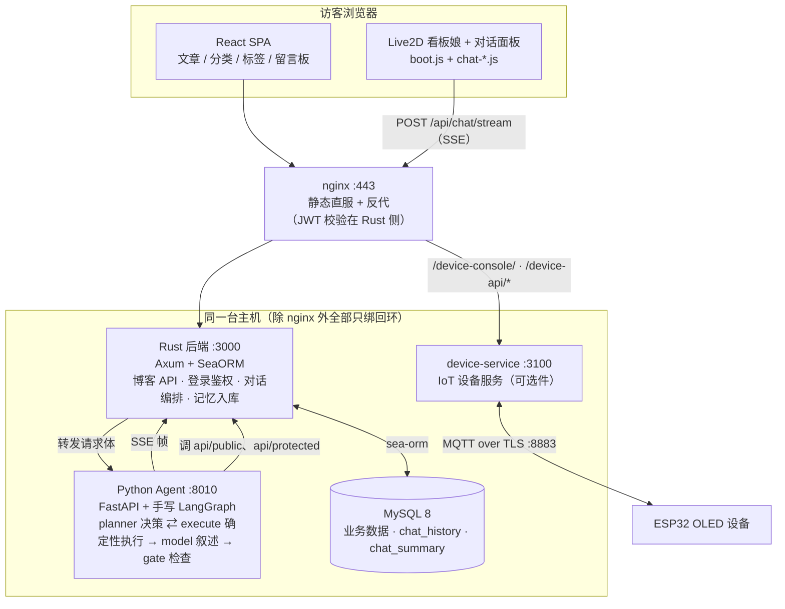
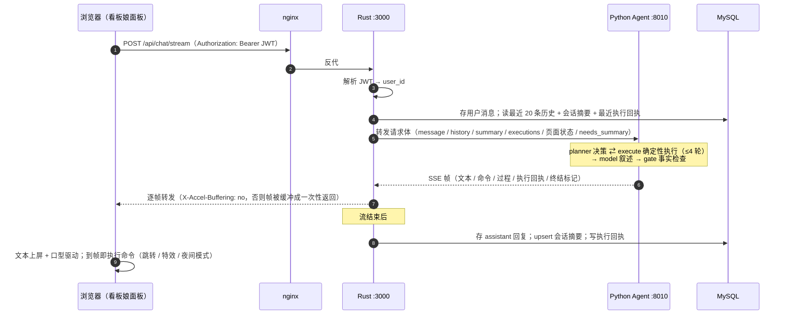
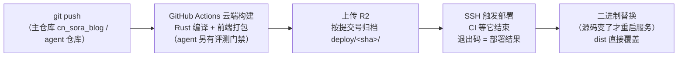

# Saudade Blog

个人博客系统。Rust 后端、React 前端、独立的 Python 对话 Agent，以及一个 Live2D 看板娘。
另有一套可选的 ESP32 物联网接入（不装不影响其余部分，见 [iot/](iot/)）。

License: GPL-2.0-or-later —— 两条版权声明（上游与本仓）与第三方组件说明见
[LICENSE](LICENSE) 与 [THIRD-PARTY.md](THIRD-PARTY.md)。

示例站点：<https://saudade.site>

看板娘"泠月喵"可以回答关于站内文章的问题、跳转页面、开关页面特效、切换夜间模式；
接入物联网后还可以把内容推送到 ESP32 的 OLED 屏上。她的对话能力来自一个独立部署的
Python Agent（手写 LangGraph 图：**planner ⇄ execute → model → gate**）。对话记忆全部外置
MySQL，agent 进程本身无状态：每次请求都是新线程，连续性由后端注入历史与摘要维持。

首页另有一件展品：**文章向量空间图谱**。它把本站文章抽出的关键词按 embedding 投到三维空间，
点是词、相关的词之间连线，可拖动视角、双击词跳转文章，也能在下方输入框里做**向量检索**定位。
点画多大按**文章热度**（浏览、点赞、收藏、评论加权）算，不按词的重要度。

图谱是**按站点构建**的产物，而"换一批文章"这件事不需要你改代码或重新部署：后台
**「站点设置 → 向量图谱」**有一个页面，点一下就在服务端按当前**公开文章**重算一遍——
进度、内存占用与日志尾部轮询可见，跑完**刷新首页就是新图**。产物的主题词与 embedding
由 agent 仓的建图脚本负责；重建任务把产物写到 agent 自己的目录后，由后端直接供出
（`GET /api/public/graph/manifest` + `/api/public/graph/artifact/:file`，见下），
仓库里 committed 的那份 `frontend/public/graph/` 只是"从没重建过的站点"的种子。

归属站点闸在**运行期**判、不在构建期：产物里记的 `site` 与访客浏览器的 origin 不一致时，
展品渲染成"文章向量空间尚未为本站点生成，请在后台重建"——把该做什么直接告诉你，
而不是让卡片凭空消失。所以迁移到自己的机器后，重建一次就够了。

它与对话是两条独立的检索线：图谱查询走 1024 维精确余弦（纯 Python 点积），agent 问答走
词法 BM25（语料量小，且要为低配部署留内存余量）。**热度只影响画多大，不参与检索排序**
（局部关键词回退仍按词的重要度打分，否则热门文章的词会垄断所有查询）。
细节见 [docs/word-graph.md](docs/word-graph.md)。

## 站上有什么

- **写作与内容**：Markdown 文章（内嵌编辑器）、分类与标签、封面裁剪、图库。
- **阅读与互动**：站内搜索、阅读量/点赞/收藏、评论区（Markdown、表情、点赞与踩、
  就地展开回复）、河灯留言板与灯影集、友链、公告。
- **看板娘对话**：站内问答、页面跳转、特效与夜间模式开关；接入 IoT 后还能把内容推到
  ESP32 的 OLED 屏（见《架构一览》与会话时序）。
- **展示柜**：文章向量空间图谱，可由后台一键按当前公开文章重算（见上文）。
- **后台**：内容/评论/留言板管理、用户与角色、对话额度、站点设置与待办、访问统计。
- **可选件**：ESP32 物联网接入（MQTT over TLS + 设备控制台），不装不影响其余部分。

## 架构一览



| 组件 | 职责 | 位置 |
|---|---|---|
| **Rust 后端**（Axum + SeaORM + MySQL 8） | 博客主流量（文章/分类/标签/友链/留言板）、登录鉴权（JWT）、聊天链路中枢（鉴权 → 历史入库 → SSE 逐帧转发） | `src/` |
| **前端**（React 18 + Vite + antd + bytemd） | SPA；看板娘与聊天面板由 `live2d-widgets/`（boot.js 入口，纯 JS 子模块拆分）驱动 | `frontend/` |
| **AI Agent**（FastAPI + 手写 LangGraph） | 看板娘大脑：对话生成、博客查询、导航/特效/夜间命令、IoT 设备显示。**独立 git 仓库** | `saudade-blog-agent/` |
| **IoT**（EMQX 5 + Rust device-service） | ESP32 设备接入（MQTT over TLS）、OLED 显示、设备控制台（`/device-console/`）。**可选件**，出厂默认不启用 | `iot/`；服务本体不在本仓，见 [iot/device-service/README.md](iot/device-service/README.md) |

Agent 的核心理念是**把执行层的自由拿掉**。固定流程任务（导航/特效/夜间/设备显示）落地为
`skills.py` 里的静态技能定义：
**planner 是唯一决策者**（选技能 + 填参数 + 产出调用清单），**execute 是确定性执行器**
（照单执行，无授权分支、无自由意志），每条执行再经 checker 验收（PASS 才成为系统确认事实），
最后 **model 零工具叙述**（结构上发不出工具调用）、**gate 确定性检查**叙述是否失真。
于是"模型假装执行"在拓扑上不可能发生。记忆方面，模型对记忆**无写权限**：滚动摘要由后端
独立任务生成。详细架构见 [agent 仓库](https://github.com/BigLeopardCat/saudade-blog-agent)
的 README 与 `docs/agent-architecture.md`。

### 一次对话的时序

上图画的是"谁连着谁"，这张画的是"一轮对话里谁先谁后"。**记忆的读写全在 Rust 这一侧**，
Agent 进程本身不存任何对话状态 —— 它拿到的是 Rust 从库里读好、塞进请求体的那几段。



> 完整分段（每一步做了什么、字段叫什么、失败怎么收场）见 agent 仓库
> `docs/agent-architecture.md` 的《3. 一次对话的完整链路》。

## 项目结构

```
Saudade-Blog/
├── src/                      # Rust 后端（Axum + SeaORM + MySQL 8）
│   ├── main.rs               # 入口：读 .env、连库、只监听 127.0.0.1:3000（对外靠 nginx 反代）
│   ├── routes/               # 全部 HTTP 路由与 handler，mod.rs 是挂载点（公开/受保护两张路由表）
│   │   ├── chat.rs           # 对话核心：鉴权、历史入库、SSE 逐帧转发、断连清理
│   │   ├── notes.rs          # 文章列表/详情/站内搜索
│   │   ├── graph.rs          # 向量图谱：产物供给 + 后台重建代理
│   │   └── …（评论、留言板、标签、上传、后台统计…）
│   ├── entity/               # sea-orm 实体定义（与数据库表一一对应）
│   ├── auth_jwt.rs           # JWT 签发与校验（HS256）
│   ├── authz.rs / quota.rs   # 角色权限判定 / 对话额度
│   └── middleware.rs         # 请求日志、CORS 等中间件
├── frontend/                 # React SPA（**不含**看板娘，见下文《看板娘前端》）
│   ├── src/
│   │   ├── frontHome/        # 前台页面（首页、文章页、展示柜…）
│   │   ├── pages/            # 登录页、河灯讨论区（RiverBoard）、后台 Dashboard
│   │   ├── components/       # 通用组件（评论区、编辑器、徽章…）
│   │   ├── apis/             # 后端接口封装
│   │   └── router/           # 路由表
│   ├── public/               # 静态资源；构建前 `npm run fetch:widget` 取回看板娘（见下）
│   ├── tests/                # 前端测试（*.test.mjs 进 CI；*.test.py 无头沙箱走夜间）
│   └── vite.config.ts        # 构建配置（站点地址等构建期变量在这里读）
├── saudade-blog-agent/       # 看板娘的"大脑"（**独立 git 仓库**，本仓 .gitignore 忽略）
├── iot/                      # ESP32 物联网接入（可选件：控制台、固件骨架、开关脚本）
├── deploy/                   # 部署模板（nginx / systemd ×2 / logrotate）+ 从零部署走查
├── scripts/
│   ├── migration/            # 建库与增量迁移（入口 fresh_install.sh，**别手跑 *.sql**）
│   ├── deploy/               # 部署脚本（CI 调用；也可手动兜底）
│   ├── dev/                  # 开发辅助（如装 git hooks）
│   ├── verify_uploads.py     # 核对"库里引用的图"与"盘上文件"（迁移/恢复的验收判据）
│   └── healthcheck.sh        # 心跳探针（建议 cron 周期执行）
├── uploads/                  # 上传件（图片 + avatars/）——默认位置，**不进 git**，见下
├── docs/                     # 设计文档：部署与运维 / 安全边界 / 向量图谱 / IoT
├── tests/                    # 后端集成测试（跟着 cargo test 跑；tests/manual/ 需活服务）
└── .github/workflows/        # CI/CD（push 自动构建 + 部署）
```

> **`uploads/` 是上传件的默认位置**：不配 `UPLOAD_DIR` 时落在这里，目录在**第一次上传时
> 自动创建**（无需手工 mkdir），`.gitignore` 已忽略它。对"clone 下来跑跑看"这样正好；
> **生产建议用 `.env` 的 `UPLOAD_DIR` 把它指到工作区之外**——它是全站唯一**只有盘上一份**
> 的数据（文章正文与封面存的是指向它的 URL，库里的记录不会随文件一起回来）。
>
> 因此**迁移/恢复 = 两件一起走**：数据库 dump ＋ `UPLOAD_DIR` 那个目录。落地后跑一次
> `python3 scripts/verify_uploads.py`，它会把"正在被引用却有文件缺失"的图连**是哪篇文章**一起
> 列出来；那一节为零，就说明这次搬家是完整的。

## 快速开始

前置：**Rust** stable、**Node.js** ≥ 18、**MySQL** 8。想跑 AI 对话再加 **Python** 3.10+。

```bash
git clone https://github.com/BigLeopardCat/Saudade-Blog.git && cd Saudade-Blog
# 默认分支是 cn_sora_blog（不是 main），clone 下来就在它上面

# 1) 建库。库名必须叫 saudade_blog，用脚本建而不是把 *.sql 按文件名顺序全跑一遍
ALLOW_PRODUCTION_NAME=1 bash scripts/migration/fresh_install.sh saudade_blog -uroot -p

# 2) 再建一个应用账号（后端进程用它连库，别拿 root 跑），并照 §2.1 授权
# 3) 配环境变量；DATABASE_URL 与 JWT_SECRET 不配就起不来，对外部署还要改 SITE_URL
cp .env.example .env

# 4) 起后端（只监听回环，前面挂 nginx 才对外）
cargo run
```

前端、agent 与 IoT 各自的起法，"哪些迁移脚本不能无脑跑""两个站点地址变量为什么都要设"
这类问题，都在 [CONTRIBUTING.md](CONTRIBUTING.md) 的《2. 跑起来》里。每个环境变量干什么、默认值是什么，看
[.env.example](.env.example)（它是这一类信息在本仓的唯一出处）。

## 部署流程

本节描述的是**本仓自带的那套 CI/CD**（`.github/workflows/deploy.yml` + `scripts/deploy/`，
两者都在仓库里，谁都能读、能改），以及维护者用它的方式。先说清楚边界：

> **"本地不编译"是维护者那一侧的纪律，不是对你的要求。** 他跑这套东西的那台机器
> **同时是生产服务器**（`cargo build --release` 与 `vite build` 的内存开销会把整机拖垮——
> 这事真发生过）。你把仓库 clone 到自己机器上，想怎么构建就怎么构建，不受这条约束。
>
> **fork 之后**：部署那一半要自己的 R2 凭据与 SSH 私钥（都是仓库 secret），不配它就只跑得起来
> 另一半——`check`（测试与类型检查）**一个 secret 都不需要**，所以你 fork 出去照样有完整的质量反馈。
> **PR 上也只跑 `check`**，不会有人因为提了个 PR 而把维护者的线上换掉。

维护者本地的验证只用轻量命令（`cargo check` / `tsc` / `npm test`），构建交给 CI。



> 注意这套流程的语义：**CI 的绿灯代表"真部署成功了"**，不是"构建过了"——
> 部署脚本的退出码会被 CI 等回来。线上到底跑的是哪个提交，只认 `build-info.json` 里的 sha。

按组件（下面这些"本地怎么做"说的都是**维护者那台生产机**上的做法）：

- **后端（本仓库 `src/`）**：他那台机子上只做 `RUSTFLAGS="-D warnings" cargo check`（严格自检；
  CI 未设 RUSTFLAGS，warning 不挂构建——此模式是本地纪律，不是 CI 门槛），push 即由 CI 编译部署。
  你本机 `cargo build --release` 随意。
- **前端（本仓库 `frontend/`）**：同上，他本地不构建、push 走 CI。**改动前先读
  [frontend/README.md](frontend/README.md) 的《改这里的文件要 bump 版本号》一节**——
  看板娘前端的缓存版本号要在多处同步，漏一处访客会继续吃旧脚本。
- **Agent（`saudade-blog-agent/`，独立仓库）**：改技能/工具/prompt 后需重启服务才生效；
  push 走独立 CI。改技能注册表 / plan 契约 /
  摘要逻辑后必跑 `test_skills.py`（L0）与 `eval/run_golden.py`（L2 真实 LLM 端到端）。

## 部署与运维

**这一节描述的是本项目的线上部署**（维护者那一台机器），不是本仓对你的要求——
fork 之后按你自己的方式跑就行，本节的价值在于：想读懂 `scripts/deploy/`、`healthcheck.sh`
与那些日志路径时，能对上号。

> **想在自己机器上真的部署一份**（nginx 站点配置、两个 systemd 单元、TLS 证书、
> 目录布局与权限、首次建库与第一个管理员、logrotate、日常更新）→ 走
> **[deploy/README.md](deploy/README.md)**。那一份是**可复制的步骤**，模板都在
> [deploy/](deploy/) 目录里；本节讲的是"它长什么样、为什么这么摆"。
> **只想装起来的话**，那一份开头有一条命令：`bash deploy/install.sh`
> （向导会问要不要连 IoT 可选件一起装，`-y` 下默认不装；`--dry-run` 只渲染不落地）。

服务均为 systemd 托管（agent/rust 为 `Restart=always` 崩溃自愈；device 为 `Restart=on-failure`）：

| 服务 | 端口 | 说明 |
|---|---|---|
| Rust 后端 | :3000 | 博客 API + 对话编排 |
| Python Agent | :8010 | AI 看板娘（4 workers；`TimeoutStopSec=120` 优雅停等在途对话） |
| IoT device-service | :3100 | 设备服务（源码在独立目录，**不经 CI**，改后手动构建重启）。仅启用 IoT 时存在 |
| nginx / EMQX | :443 / :8883 | 入口 / MQTT over TLS（8883 是唯一对公网开放的设备端口）。EMQX 同理 |

日志统一在 `logs/`，按组分层（logrotate 按日轮转、定期归档）：

- `logs/agent/` —— **agent 组**：agent.log + `traces/`（每轮对话的节点耗时 trace JSON，排障首选）
  + `golden_traces/`（评测 golden set 每次运行落一份，排障不看这里）
- `logs/frontend/` —— **前端组**：monitor.log（浏览器 JS 异常 / 接口失败 / 资源加载失败 /
  React 渲染期崩溃自动上报；`type` 是闭集、同一条按 60 秒计数合并，行格式见
  [deployment-and-ops.md](docs/deployment-and-ops.md) 的日志一节）
- `logs/` 根 —— 后端组：rust.log（含全局 access 行）、health.log（探针）、deploy.log（CI 触发）、device.log

探针 `scripts/healthcheck.sh`（建议由 cron 周期执行）：服务存活检查 + uvicorn worker 崩溃检测 +
nginx error.log 增量扫描，异常追加 health.log。

## 给贡献者

- **想参与**：[CONTRIBUTING.md](CONTRIBUTING.md)（怎么在本地跑起来、提交约定、
  哪些命令是"维护者那台机器上不能跑"而不是"你不能跑"）、[ROADMAP.md](ROADMAP.md)
  （现在做什么、什么在等一个条件、什么明确不做）、[CODE_OF_CONDUCT.md](CODE_OF_CONDUCT.md)、
  [SECURITY.md](SECURITY.md)（安全问题的私密报告通道）。
- **测试分几层、各验什么、在哪儿跑**：[CONTRIBUTING.md](CONTRIBUTING.md) 的 §3 是唯一清单
  ——`tests/`（跟着 `cargo test`：MockDatabase 一层 + 真 MySQL 一层）、`tests/manual/`
  （要活服务与真凭据，手动跑）、`frontend/tests/`（`*.test.mjs` 进 CI；`*.test.py` 无头
  Chrome 沙箱走夜间）。建库的第一步也在那儿（§2.1）。
- **新增 Agent 工具**：在 `tools/base.py` 用 `@tool` 定义并加入 `_TOOL_REGISTRY`；若服务于
  固定流程任务，**必须**在 `skills.py` 注册对应技能（触发条件 + 工具序列模板 + 回复契约），
  否则 planner 无法可靠选择它——这是 agent 的核心约定。
- **接口一览**：公开（登录、文章/分类/标签/友链/留言板、评论点赞踩、图谱产物
  `/api/public/graph/{manifest,artifact/:file}`、聊天 SSE `/api/chat/stream`、
  前端监控上报 `/api/monitor/log`）；**路径在公开表、但 handler 内要求登录**的只有一条——
  图谱检索 `/api/public/graph/query`（它要花 embedding 调用，不能真匿名开放）；
  受保护（JWT + 管理员：内容增删改、图片上传、后台统计与审核、图谱重建
  `/api/protected/graph/rebuild*`、`/device-api/*`）。
- **SSE 帧协议**：`\n\n` 分隔 + JSON 编码；命令帧（导航/特效/夜间）、`__PROCESS__` 过程轨迹、
  `__RESET__` 否定轮清屏、`__SUMMARY__` 摘要回流、`__END__` 结束。改协议三端（Python/Rust/前端）同步。
- **设计与文档索引**（`docs/`）：
  [部署与运维手册](docs/deployment-and-ops.md)（拓扑端口 / CI-CD / systemd / 日志 / 排查）、
  [安全边界与加固](docs/security-boundary.md)（信任边界、输入限额、已知缺口）、
  [向量图谱](docs/word-graph.md)（选词 / 降维 / 布局 / 检索的完整实测记录）、
  [IoT 设备接入](docs/iot-device-integration.md)。
- **Agent 侧机制**（模型行为边界、断连中断、防幻觉闸、评测体系）见
  [saudade-blog-agent](https://github.com/BigLeopardCat/saudade-blog-agent) 的 `docs/`。
- **第三方组件与许可**：[THIRD-PARTY.md](THIRD-PARTY.md)。

## 许可

本仓库以 **GPL-2.0** 分发，全文与版权声明见 [LICENSE](LICENSE)。
第三方组件及其许可见 [THIRD-PARTY.md](THIRD-PARTY.md)。

本仓库**不是从零写的**：它源于 [Memory-Blog](https://github.com/LinMoQC/Memory-Blog)
（版权归 **林陌青川 (LinMo)**），本仓库是它的 Rust + Axum 重写分支。License 头部因此有
**两条**版权声明（上游的与本仓库的），**分发时一条都不能删**。

要在本仓库基础上二次开发：把你自己的版权声明**追加**在 LICENSE 的版权链后面即可；
站点的署名走后台的站点设置（`blogCopyright`），**不用改代码**。来源链的完整说明见
[THIRD-PARTY.md §0](THIRD-PARTY.md)。

### 看板娘前端（不在本仓）

看板娘前端（`live2d-widgets/` 与 `live2d_model/`：渲染层、聊天面板、模型与贴图）不在本仓，
它住在 agent 仓。本仓构建时按 `frontend/widget.lock.json` 里钉死的提交号把它取回来打进产物，
路径与从前完全相同，因此服务端与测试零改动。

这棵树的许可分两半，边界按"文件是代码还是美术"划，与目录结构无关：

- **代码**（`boot.js` / `renderer.js` / `chat-*.js` / `widget.css` 等）以 **MIT** 分发，可商用。
  版权与许可声明照录于本节末尾，MIT 要求它随分发一起带上。
- **美术资源**（`live2d_model/agent_2.*` 模型与贴图、`lingyue-toggle.png` 面板图标，以及
  「泠月喵」这个**形象设计本身**）以 **CC BY-NC-SA 4.0** 分发（署名 · 非商业性使用 ·
  相同方式共享）：可以自用、可以改，**不可商用**，改作必须以同样协议分发。全文见 agent 仓的
  [frontend/ASSETS-LICENSE.md](https://github.com/BigLeopardCat/saudade-blog-agent/blob/main/frontend/ASSETS-LICENSE.md)。
  需要留意的是它**不是** OSI 意义上的开源许可，这一部分属于"源码可用"：fork 出去做**商业**
  站点时不能带这套美术，把 `live2d_model/` 换掉即可；代码那一半仍是 MIT。

### MIT 全文（适用于看板娘前端的代码）

```
MIT License

Copyright (c) 2026 BigLeopardCat

Permission is hereby granted, free of charge, to any person obtaining a copy
of this software and associated documentation files (the "Software"), to deal
in the Software without restriction, including without limitation the rights
to use, copy, modify, merge, publish, distribute, sublicense, and/or sell
copies of the Software, and to permit persons to whom the Software is
furnished to do so, subject to the following conditions:

The above copyright notice and this permission notice shall be included in all
copies or substantial portions of the Software.

THE SOFTWARE IS PROVIDED "AS IS", WITHOUT WARRANTY OF ANY KIND, EXPRESS OR
IMPLIED, INCLUDING BUT NOT LIMITED TO THE WARRANTIES OF MERCHANTABILITY,
FITNESS FOR A PARTICULAR PURPOSE AND NONINFRINGEMENT. IN NO EVENT SHALL THE
AUTHORS OR COPYRIGHT HOLDERS BE LIABLE FOR ANY CLAIM, DAMAGES OR OTHER
LIABILITY, WHETHER IN AN ACTION OF CONTRACT, TORT OR OTHERWISE, ARISING FROM,
OUT OF OR IN CONNECTION WITH THE SOFTWARE OR THE USE OR OTHER DEALINGS IN THE
SOFTWARE.
```
