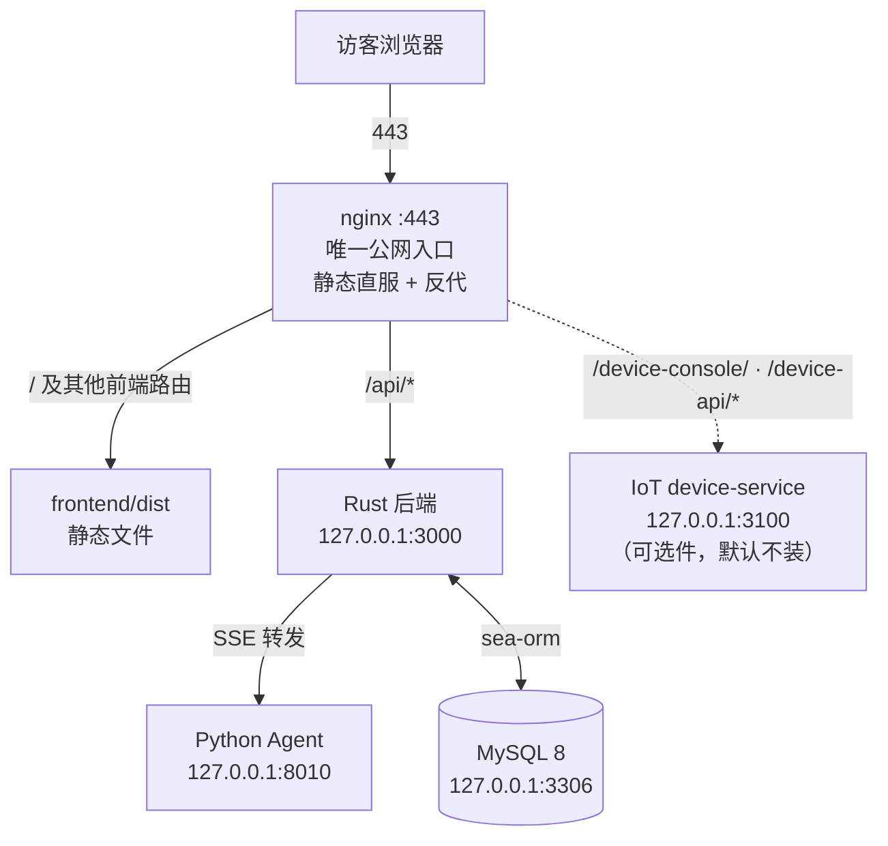

# 从零部署

> **这份文档与 [docs/deployment-and-ops.md](../docs/deployment-and-ops.md) 的分工：**
> 那一份讲**设计判断与排障思路**（为什么这么摆、出问题往哪看），坐标全部收掉了；
> 这一份是**可复制的步骤**——照它走，能把一台空 VPS 变成跑着的站点。
>
> 只想在本地开发、跑测试、提 PR：走 [CONTRIBUTING.md §2](../CONTRIBUTING.md)，不用读这份。
>
> 模板都在这个目录里，`__APP_DIR__` / `<你的用户名>` / `<你的域名>` 是占位符，**不是能直接 cp 的文件**
> ——每一份的开头都写了怎么替换。
>
> ⚠️ 别把本目录与 [`scripts/deploy/`](../scripts/deploy/) 搞混：那是**本仓 CI/CD 的运行时代码**
> （`deploy_from_r2.sh` 等，被 CI 调用、改了会触发一次真部署）；`deploy/` 这一份里的模板是
> **给人看的**，本仓的 CI 不碰它们——`deploy/**` 不在 `deploy.yml` 的任何一组路径过滤器里，
> 所以只改这里的 push 会让 CI 判定"本次无可部署变化"而跳过部署（绿灯、什么都没上线）。
>
> 只有 [install.sh](install.sh) 是**可执行的**，而它跑在**你要部署的那台机器上**（不是 CI、
> 也不是本仓的部署管线）。它读的就是本目录这几个模板——模板是唯一事实源，脚本只做渲染。

---

## 一条命令装完（推荐先看这个）

下面 §1–§12 是逐步走查；**只想把它装起来的话，一行就够**：

```bash
git clone https://github.com/BigLeopardCat/Saudade-Blog.git && cd Saudade-Blog
git clone https://github.com/BigLeopardCat/saudade-blog-agent.git saudade-blog-agent
bash deploy/install.sh                     # 交互向导；口令用 read -s 问，不回显
```

它按 §3–§10 的顺序把整条路走完：前置检查 → 目录权限 → 建库/应用账号/第一个管理员 →
两份 `.env` → agent 的 `.venv` → 构建（`cargo build --release` + `vite build`）→ TLS 证书 →
nginx → systemd ×2 → logrotate + 心跳 cron → 起服务 → 验收。**幂等**：重跑安全，
但"安全"的含义要说准（20261007 修订）——

- `.env` 分两种情况：**这次刚由脚本从 `.env.example` 创建** ⇒ 生成的值一律**顶掉**模板里
  那些占位说明（`改成你的密码` / `请换成……` / `example.com`）；**本来就在** ⇒ 只补缺键，
  你改过的值一个都不动。
- **口令与 `JWT_SECRET` 从 `deploy/.credentials` 沿用**，不会每次重掷 —— 重掷等于把一台
  跑着的机器锁在门外（库里被 `ALTER USER` 改成新口令，而 `.env` 里还写着旧的）。
- 库里已经有表 ⇒ 跳过建库，但会把**迁移台账**（`migration_flags` 有几条、最近一条是什么）
  摆出来；「建全了没有」由你自己对照 `scripts/migration/` 判断，安装脚本刻意不下这个结论。
- 配置文件一律"渲染 → 语法自检 → 替换"（先写临时文件再 `mv`，中途失败原文件不动）。
- **验收的退出码是真的**：有项目没通过时脚本以非 0 退出（20261007 之前这里恒返回 0，
  在 CI / 脚本 / runbook 里永远是"成功"）。

```bash
# IoT（EMQX + 控制台 + 设备接入，见 iot/README.md）是**选装件**：
# 交互向导会问你一句（默认不装）；不想被问就直接表态——
bash deploy/install.sh --with-iot

# 站点已经在跑，只补装 IoT
bash deploy/install.sh --iot-only

# 非交互（CI、脚本里调）：所有值都能用 flag 或同名大写环境变量预填
bash deploy/install.sh -y --domain blog.example.com --admin-pass "$(openssl rand -hex 12)"

# 先看看它会做什么：渲染产物落临时目录，系统一个字节都不改
bash deploy/install.sh --dry-run -y --domain blog.example.com
# 然后跟线上对一遍（本仓的站点配置就是这么核对过的）：
#   diff -u /etc/nginx/sites-enabled/blog <那个目录>/etc/nginx/sites-available/blog
```

`bash deploy/install.sh --help` 是全部 flag 的清单（域名、库名、管理员、上传目录、
证书、站点名与描述、LLM 提供方与 key、EMQX 版本…）。

> **向导会问的只有"还没定过的"那些项**：flag / 同名大写环境变量给过的，它一声不吭直接用；
> `-y` 则一律取默认（可选件因此**默认不装**）。`--vite-heap MB` 是构建期拨盘，
> 见 §6。

四条要知道的边界：

- **它不替你装系统包**。缺 `nginx` / `mysql` / `cargo` / `uv` 就停下并给出各发行版的安装命令
  ——装错了比没装更难查，这一步交给人。
- **它不猜**。`--domain` 不给就按"只有 IP"的形态装（乙块整块略去，靠自签证书 + 兜底块应答）；
  非 Ubuntu 上装 EMQX 会明确告诉你"这一步要你自己下 .deb"，而不是硬跑一遍装错。
- **凭据落在 `deploy/.credentials`**（0600，已 gitignore）。脚本**只打印那个路径，不打印值**；
  MySQL root 口令走 0600 临时 defaults 文件，不进 `ps`；管理员口令从 stdin 喂 SQL。
  看完请自行转移或删除。
  ⚠️ 这份文件里的**管理员口令要当"这次想用的口令"读，不是"一定登得进去的口令"**：
  库里已经有管理员时脚本不会改它的口令（那是显式动作，见 §4.3）。重跑时脚本会当场核一遍
  并告诉你对得上/对不上（老格式 SHA-256 能当场算，Argon2id 只能靠真登录那一下）。
  模型 API Key **不写进这份文件**（它不属于"本机生成的东西"）。
- **device-service 它补不了**——源码不在任何公开仓（见
  [iot/device-service/README.md](../iot/device-service/README.md)）。装 IoT 的那一趟最后会把
  缺口与接口契约打成清单给你。

> ⚠️ `--with-iot` 会真的改四处：`/etc/emqx/`、`/etc/nginx/snippets/blog-iot/`、
> **两份** `.env` 的 `IOT_ENABLED`、以及 EMQX 的认证链与 ACL（ACL 是**全量替换**语义）。
> 三处消费面必须同源这件事见 [iot/README.md](../iot/README.md)。

> **另有一条 Docker 路**（[deploy/docker/](docker/)）：**一条 `docker compose up -d` 起整套站**
> （MySQL + Rust 后端 + agent + nginx），`prepare.sh` 在宿主侧生成配置与自签证书。它**只给
> "自己有一台 Linux 机器、有一个域名"的人**用：三个服务走 host 网络（所以 Docker Desktop
> 不成立）、占宿主 80/443、镜像**只能本地 build 不许推 registry**、**没有 IoT / 设备控制台**、
> 也没有 logrotate / 心跳 / trace 保留 / 部署管线（日志与上传件会无界增长，得自己挂 cron）。
> 它与上面这条 `install.sh` 的路**共用同一份 nginx 渲染器**——同一组输入下产物逐字节相同。
> 边界、验收清单（11 条）与排障见 [docker/README.md](docker/README.md)。

---

## 0. 全貌：一次部署由什么组成



**两个 git 仓库**（都是公开仓）：

| 仓 | 克隆到哪 | 谁在用 |
|---|---|---|
| 父仓 Saudade-Blog（本仓） | 部署根目录 | Rust 后端、前端、迁移、部署脚本 |
| `saudade-blog-agent` | **部署根目录下的 `saudade-blog-agent/`** | 看板娘对话（FastAPI，回环 :8010） |

agent 仓被父仓 `.gitignore` 忽略，**不在父仓的 CI 里、也不随父仓部署**——它有
自己的仓库与流程。所以"部署"这件事对它们两个是**分开的**：父仓走 CI，agent 仓走
`git pull` + 重启（见 §11）。

**除 nginx 外所有服务只绑回环**。这是整套信任模型的基石；边界与实测命令见
[security-boundary.md](../docs/security-boundary.md)。

---

## 1. 前置

- 一台 Linux 机器（本项目的示例部署是 4 vCPU / 3.7 GB / 40 GB，见
  [deployment-and-ops.md §8](../docs/deployment-and-ops.md)）；**纯生产占用约 0.4–0.6 GB 内存**
- **MySQL 8**
- **nginx**
- **Rust** stable（只有你要在本机构建二进制时才需要；用 CI 构建就不需要）
- **Node.js ≥ 18**（同上，只有本机构建前端才需要）
- **Python 3.10+** 与 [`uv`](https://docs.astral.sh/uv/)（agent 用 `uv.lock` 钉依赖）
- 一个**非 root 用户**（Ubuntu 云镜像默认是 `ubuntu`）。下面一律用 `<你的用户名>` 指代

---

## 2. 目录布局

先把两个仓摆成这个形状——**路径关系是承重的**，不是风格问题：

```text
__APP_DIR__/                       ← 部署根目录；父仓克隆在这里
├── .env                           # 后端环境变量（不进 git，见 §5）
├── src/  frontend/  scripts/  docs/  iot/
├── target/release/saudade_blog_bin   # Rust 二进制（CI 产出 / 本机构建）
├── frontend/dist/                 # 前端产物 = nginx 的 root
├── logs/                          # 全部日志（0700，见 §9）
│   ├── rust.log  deploy.log  health.log  device.log
│   ├── agent/agent.log
│   └── frontend/monitor.log
├── uploads/                       # **上传件的默认位置**（见下方警告）
└── saudade-blog-agent/            # agent 仓克隆在这里，路径名不要改
    ├── .env                       # agent 自己的环境变量（与父仓那份**不是一个文件**）
    ├── .venv/                     # uv sync 建的虚拟环境
    └── data/                      # rag_vectors/、word_graph/ 等运行期产物
```

```bash
git clone <父仓地址> __APP_DIR__ && cd __APP_DIR__
git clone <agent 仓地址> saudade-blog-agent     # 必须叫这个名字、必须在部署根目录下
```

> ⚠️ **上传件是全站唯一只有盘上一份的数据。** `uploads/` 是**出厂默认**位置（方便克隆
> 下来直接跑），但生产应当显式用 `UPLOAD_DIR` 把它指到**工作区之外**（例如
> `/home/<你的用户名>/saudade-uploads`）。理由很实际：工作区会被部署脚本、`git clean`
> 之类的操作翻动，而这里放的是**没有第二个副本**的图片与头像。
> 换目录时**必须连同已有的文件一起搬**，否则库里的 URL 会整片 404 而不报任何错
> ——`scripts/verify_uploads.py` 就是为验收这件事写的（退出码 0 = 没有"正在被引用却
> 在盘上找不到"的图）。

---

## 3. 用户与文件权限

三个常驻服务（rust / agent / 可选的 device）**用同一个非 root 用户**跑，单元文件里的
`User=` / `Group=` 都是它。不要用 root 跑服务。

```bash
# 日志目录：0700 + 服务用户属主。logrotate 会**静默跳过**属主不对的文件（见 §9）
mkdir -p logs/agent logs/frontend
chmod 700 logs logs/agent logs/frontend

# 上传件目录（在工作区之外，见 §2 的警告）
mkdir -p /home/<你的用户名>/saudade-uploads
```

两份 `.env`（§5 才建）里有数据库口令与 `JWT_SECRET`，建完记得 `chmod 600`。

要 `sudo` 的只有运维动作：`systemctl`、`nginx`、`logrotate`。

---

## 4. 首次建库、应用账号、第一个管理员

### 4.1 建库

数据库名**必须叫 `saudade_blog`**：`scripts/migration/*.sql` 里绝大多数文件开头写死了
`USE saudade_blog;`。用一个脚本建，**不要**自己把 `*.sql` 按文件名顺序全跑一遍
（原因见 [CONTRIBUTING.md §2.1](../CONTRIBUTING.md)：基架是生产库快照，照单全跑必然
撞一堆 `Duplicate column name`）。

```bash
ALLOW_PRODUCTION_NAME=1 bash scripts/migration/fresh_install.sh saudade_blog -uroot -p
```

脚本最后会报出表数。收尾形如 `库里共 29 张表` 即正常（26 张基架 + 快照后的增量迁移）。

### 4.2 应用账号

后端进程**不拿 root 连库**（root 只用来建库、跑迁移、救急）：

```bash
mysql -uroot -p -e "
  CREATE USER 'saudade_blog'@'localhost' IDENTIFIED BY '换成你自己的密码';
  GRANT ALL PRIVILEGES ON saudade_blog.* TO 'saudade_blog'@'localhost';
  FLUSH PRIVILEGES;"
```

用户名要与 `.env` 里 `DATABASE_URL` 那一段一致。**库里没有任何地方写死它**——换名字
建号之后改 `.env` 就行。

> ⚠️ 上面那条建的是 `@'localhost'`，而 `DATABASE_URL` 里的主机写的是 `127.0.0.1`。
> 这两个能不能对上，取决于 MySQL 有没有做反向名字解析：`skip_name_resolve` **关着**
> （默认）时 127.0.0.1 会被解析成 localhost，打开时就不会——而打开它是很多"MySQL 加固
> 清单"的第一条。症状是 `Access denied for user 'saudade_blog'@'127.0.0.1'`，而账号在库里
> 明明有。`bash deploy/install.sh` 的做法是**两个 host 都建一遍**，手搓的话照做：
> 把上面那条 `CREATE USER`/`GRANT` 用 `@'127.0.0.1'` 再跑一次即可。

### 4.3 第一个管理员

> ⚠️ **这个项目没有注册入口。** `src/routes/mod.rs` 里没有 register / signup 路由，
> 注册页不存在——**user 表只能手工 INSERT**。这既是"个人博客不开放注册"的设计，
> 也是一处已知缺口（见 §12）。

所以第一个管理员是这样建的：

```bash
mysql -uroot -p saudade_blog -e "
  INSERT INTO \`user\` (username, nickname, password, role)
  VALUES ('admin', '站长', SHA2('换成你的密码', 256), 'admin');"
```

三点要知道：

- **`role` 是准入的关键那一列**：`admin` 才能进后台（`/dashboard`），普通用户是 `user`。
  想再建一个普通账号，同样 INSERT，把 `role` 换成 `'user'`。
- **`SHA2('...', 256)` 是旧格式**（无盐单轮 SHA-256）。它能用是因为
  `src/utils.rs::verify_password` 同时认新旧两种格式，并在**首次登录成功后把这一行
  就地升级成 Argon2id**（`needs_rehash`）。也就是说这条 INSERT 是"能进得去"的最省事
  路径，进去一次之后库里就是安全的哈希了。**再建新账号时，如果你手边有办法直接生成
  Argon2id PHC 串，优先用它**——`SHA2()` 是给"手上只有 mysql 客户端"的人的兜底。
- `nickname` / `status` / `token_version` / `chat_quota_used` 都有默认值，不必填。
  `status=0` 是正常，`1` 是冻结。
- **`user.username` 上有唯一键**：库里已经有一个同名账号时，这条 INSERT 会以一句
  `Duplicate entry` 收场。（用 `bash deploy/install.sh` 装的话它会先拦一道，并把两条出路
  连 SQL 一起打给你：换个用户名重跑，或者就地把那个账号的 `role` 改成 `admin`。）

> 可选：`scripts/migration/superadmin_role_20260926.sql` 能把**更高级别的
> `superadmin`** 授给 **uid=1**（超级管理员不能冻结/降级、且不出现在后台账号列表里）。
> 它锚定的是 uid 1，是给"从生产库快照一路走过来"的部署写的——你的 uid 1 正好就是
> 刚建的那个 `admin` 的话才能直接用；否则把文件里的 `id = 1` 换成你的 uid。
> **顺序照它头注写的来**（先上线代码、再改库），别反过来。

---

## 5. 环境变量：两份 `.env`，不是一个文件

| 哪一份 | 模板 | 谁读它 |
|---|---|---|
| `__APP_DIR__/.env` | 父仓 `.env.example` | Rust（`main.rs` 的 `dotenv()` 读**工作目录**下的 `.env`） |
| `__APP_DIR__/saudade-blog-agent/.env` | agent 仓 `.env.example` | Python（`config/settings.py`，pydantic-settings） |

```bash
cp .env.example .env
cp saudade-blog-agent/.env.example saudade-blog-agent/.env
```

> ⚠️ **`cp` 下来的是一份带占位值的模板，不是一份能跑的配置。** 这两份 example 里有几个
> **未注释**的占位：父仓的 `DATABASE_URL=…改成你的密码…`、`JWT_SECRET=请换成一串随机字符`、
> `SITE_URL=https://example.com`，agent 的 `BLOG_API_BASE=https://<你的域名>/api/public`。
> 忘了改不会报错——后端连不上库、agent 认真回答**别人博客**里的问题。
> （`bash deploy/install.sh` 那条路不用操心这件事：全新 `.env` 里这些占位会被它生成的值
> 直接顶掉；手改这条路得自己逐条改。）

**父仓这份**，必改的：

| 变量 | 说明 |
|---|---|
| `DATABASE_URL` | `mysql://saudade_blog:密码@127.0.0.1:3306/saudade_blog`。**不配就起不来**（`main.rs` 直接 panic） |
| `JWT_SECRET` | 登录令牌与**服务间身份断言**的签名键。**不配登录时就 panic**。长随机串 |
| `SITE_URL` | 你自己的域名。决定 sitemap 里的链接与 CORS 默认白名单；缺省是中性占位，**必须改** |
| `UPLOAD_DIR` | 上传件落盘目录（§2 的警告：生产指到工作区外） |

其余（`CORS_ALLOWED_ORIGINS`、`CHAT_HISTORY_LIMIT`、`R2_*` 等）都有默认值或可选，
`.env.example` 里逐项有注释。

**agent 这份**，必改的：

| 变量 | 说明 |
|---|---|
| `LLM_PROVIDER` + 对应的 `*_API_KEY` / `*_BASE_URL` / `*_MODEL` | 模型服务商。**`*_BASE_URL` 要设的是"你选的那个提供方"的键**（`DEEPSEEK_BASE_URL` / `QWEN_BASE_URL` / `OPENAI_BASE_URL`）；qwen 尤其要注意——不设会落到代码里的默认值，而那个值绑定的是上游维护者的接入点（症状是每次对话都 401） |
| `BLOG_API_BASE` | **你自己站点的** `/api/public` 地址。agent 的每个只读工具与 RAG 语料都从它取数。**不改的话你的看板娘会认真回答别人博客里的问题**，而且不报错 |
| `JWT_SECRET` | **必须与父仓那份逐字相同**——agent 用它验签 Rust 发来的身份断言 |
| `TRACE_DIR` | 对话 trace 落盘目录。默认值绑定上游部署环境，**自建部署须覆盖** |

**前端还有一组构建期变量**（`VITE_SITE_URL` / `VITE_SITE_TITLE` / `VITE_SITE_DESCRIPTION`
等）：它们**不在 `.env` 里生效**，要写成 CI/构建环境变量（见 `frontend/vite.config.ts`
的默认值与 [CONTRIBUTING.md §2.2](../CONTRIBUTING.md)）。

> ⚠️ agent 的配置面有一条边界：`AGENT_RECURSION_LIMIT` / `AGENT_MAX_BODY_BYTES` /
> `AGENT_MAX_CONCURRENT` / `AGENT_MAX_REVIEW` 四个**读进程环境，写 `.env` 一点作用都没有**。
> 它们要配就写在 agent 的 systemd 单元的 `Environment=` 里（模板里给了注释样例）。
> 详见 agent 仓 README 的《环境变量》一节。

---

## 6. 构建产物

需要两样东西落到 `__APP_DIR__` 下：`target/release/saudade_blog_bin` 与 `frontend/dist/`。

**推荐：交给 CI。** 父仓自带的流水线在云端跑 `cargo build --release` 与 `vite build`，
把产物打包上传到对象存储中转桶，再 SSH 到服务器执行
[`scripts/deploy/trigger_deploy.sh`](../scripts/deploy/trigger_deploy.sh) `<提交号>` 落地
（它 `nohup` 起 [`deploy_from_r2.sh`](../scripts/deploy/deploy_from_r2.sh)、在同一个 ssh
会话里等它结束）。**CI 等的是这一条的退出码** ⇒ CI 绿灯 = 真部署成功了，不是"构建过了"。
装法见 [README §部署流程](../README.md)：要自己的 R2 凭据与 SSH 私钥（都是仓库 secret）。

这么做的实际理由很硬：`vite build` 要给到几 GB 的堆（CI runner 上配的是 `4096`），与常驻
服务同机并发会 OOM 拖垮整机（本项目的示例部署上真实发生过一次）。**如果你的机器够大，
本机构建也没问题**：

```bash
# 后端
cargo build --release            # 产物：target/release/saudade_blog_bin

# 前端——三条命令的顺序不能换
cd frontend
npm ci                           # 按锁文件装依赖
npm run fetch:widget             # 看板娘前端两棵树：源码在 agent 仓，按 pin 取回来
npm run vendor:live2d            # 看板娘运行时的三份第三方产物不入库，必须单独就位
NODE_OPTIONS="--max-old-space-size=3072" npx vite build     # 这里的 3072 只是示例
```

> **`--max-old-space-size` 只是给 V8 老生代划的上限，不是硬性门槛。** **设小了的代价小得多**：
> 构建自己报 `JavaScript heap out of memory` 退出，机器安然无恙，重来一次就行；设大了才会跟
> 常驻服务抢内存、把整机拖垮。所以按机器实际内存给：`bash deploy/install.sh` 算的是
> **`min(内存 − 1024, 3072)`**（下限 512）——`3072` 是**上限**，不是"某台机器上的取值"
> （本项目的 3.7 GB 示例部署上它算出 **2699**）。要手动覆盖用 `--vite-heap MB`（它同时会
> 打印这个值的来处）。CI 的 runner 内存大得多，那边固定配 **4096**。

`fetch:widget` 与 `vendor:live2d` **顺序不能反**：前者整树替换
`public/live2d-widgets/`，后者往它的 `vendor/` 子目录里写——反了的话刚取到的
`vendor/` 会被抹掉。漏掉 `fetch:widget` 的症状是页面打得开、聊天面板也在，
**只有看板娘一帧不画**（控制台报 `chat-stream.js` 之流 404）。

---

## 7. nginx

```bash
sudo cp deploy/nginx/blog.conf.template /etc/nginx/sites-available/blog
sudo sed -i "s#__APP_DIR__#$PWD#g" /etc/nginx/sites-available/blog
sudo nano /etc/nginx/sites-available/blog     # 把 <你的域名> / <证书名> 换成实际值

# 证书：先自签把站点跑起来，或直接放正式证书——两种做法写在模板开头
sudo mkdir -p /etc/nginx/ssl

sudo ln -sf /etc/nginx/sites-available/blog /etc/nginx/sites-enabled/blog
sudo nginx -t && sudo systemctl reload nginx
```

模板里四处**容易静默出错**的地方（原文都带了注释）：

1. **`location ^~ /api/` 的 `^~` 不是装饰**。不带它，`/api/` 会被上面那条"带 content
   hash 的资源"**正则** location 抢走（nginx 里正则优先于普通前缀），于是形如
   `20260831011133_49996ec2-....png` 的上传图会"后端 200、过 nginx 404"，页面上是破图。
2. **两个 443 server 块（IP 兜底 + 域名）内容相同、彼此独立**。改一块记得改另一块。
3. **备份文件不要放 `sites-enabled/`**：那是通配 include，一个 `blog.conf.bak` 就是一组
   重复 server，`nginx -t` 报 duplicate default server。
4. **改之前先确认"生效的那一份"是哪个文件**：`readlink -f /etc/nginx/sites-enabled/blog`。
   正常输出是 `/etc/nginx/sites-available/blog`（软链）；**若输出就是它自己**，说明这台机器上
   两份是互不相干的独立文件——此时编辑 `sites-available/` 那份**不会生效**，而 `nginx -t`
   照样全绿（它测的正是生效那份，语法自然没错），于是改动看着像"没起效"。

TLS 续期：模板用的是 `/etc/nginx/ssl/` 下的证书文件。想用 ACME（certbot 之类）自动续期，
把两行证书路径换成 ACME 客户端写好的路径，并注意 80 那个跳转块——客户端需要在跳转
**之前**接住 `/.well-known/acme-challenge/`，否则续期永远失败，而症状只是"某天浏览器
报证书过期"。

---

## 8. systemd 两个单元

```bash
sudo cp deploy/systemd/saudade-rust.service.template  /etc/systemd/system/saudade-rust.service
sudo cp deploy/systemd/saudade-agent.service.template /etc/systemd/system/saudade-agent.service
sudo sed -i "s#__APP_DIR__#$PWD#g; s#<你的用户名>#$(whoami)#g" \
     /etc/systemd/system/saudade-rust.service /etc/systemd/system/saudade-agent.service

sudo systemctl daemon-reload
sudo systemctl enable --now saudade-rust saudade-agent
```

两个单元各自的注意事项写在模板里（`User`/`WorkingDirectory`/`ExecStart` 必须自洽；
rust 靠 `dotenv()` 读工作目录、agent 靠 pydantic 读 `.env`；agent 的
`TimeoutStopSec=120` 是为了不打断在途对话）。**agent 的完整启动命令**就是它的
`ExecStart`：

```
/usr/bin/env PYTHONFAULTHANDLER=1 PYTHONUNBUFFERED=1 \
    __APP_DIR__/saudade-blog-agent/.venv/bin/uvicorn server:app \
    --host 127.0.0.1 --port 8010 --workers 4 --no-access-log
```

`.venv` 由 agent 仓里 `uv sync` 建（在 `saudade-blog-agent/` 目录下跑一次）。
`--workers 4` 的取舍见 [deployment-and-ops.md §8.2](../docs/deployment-and-ops.md)：
**每加一个 worker 按 +130 MiB 估上界**（小机器上 1–2 个也够用）。

**不要 `nohup` 裸跑**：会与 systemd 抢端口，且重启后无人拉起。

---

## 9. logrotate

```bash
sudo sed "s#__APP_DIR__#$PWD#g; s#<你的用户名>#$(whoami)#g" deploy/logrotate/saudade.template \
  | sudo tee /etc/logrotate.d/saudade >/dev/null
sudo chmod 644 /etc/logrotate.d/saudade
sudo logrotate -d /etc/logrotate.d/saudade      # -d = 干跑，只打印不动作
```

⚠️ **日志文件的属主必须是跑服务的那个用户**，否则 logrotate 的 `su` 一行会让它
**静默跳过轮转**——文件一直长，而你以为轮转开着。

⚠️ trace **不在** logrotate 里，这是刻意的：trace 是"一次会话一个文件、写完即静止"的
产物，而 `rotate N` 靠同名文件后缀计数，对它完全无效（配置写着 `rotate 14`、实际最老
的文件 26 天）。它的保留期由 agent 仓的 `eval/trace_retention.py` 执行，已接进
`saudade-blog-agent/scripts/nightly_regression.sh`。

**心跳探针**（可选但推荐，cron 每分钟；只写日志、不发通知）：

```cron
* * * * * __APP_DIR__/scripts/healthcheck.sh >/dev/null 2>&1
```

---

## 10. 起服务并验收

```bash
# ① Rust 活着（/api/login 是 POST，GET 拿 405 就说明进程在应答）
curl -s -o /dev/null -w "%{http_code}\n" http://127.0.0.1:3000/api/login

# ② agent 活着，且真正 ready（不是"进程在"）
curl -s http://127.0.0.1:8010/health

# ③ 过 nginx 的整链路：首页 200
curl -sI https://<你的域名>/ | head -1

# ④ 静态兜底没被 /api/ 吃掉：随便挑一张上传图，应当是 200 而不是 404
curl -s -o /dev/null -w "%{http_code}\n" https://<你的域名>/<一张上传图的路径>
```

然后**用 §4.3 建的管理员登录 `/dashboard`**，发一篇文章，再去首页跟看板娘说句话
——对话走的是 `nginx → Rust(3000) → agent(8010) → 模型 API`，它是整条链路的最终验收。
对话无响应时按 [deployment-and-ops.md §6](../docs/deployment-and-ops.md) 的排查表走
（先看 agent 日志的退出原因，再看 trace 的分段耗时）。

`bash deploy/install.sh` 最后那一步就是上面这套的自动化版本（外加"两个单元开机自启了吗"）：
**它现在以真退出码收场** —— 有项目没通过就非 0 退出，并把没通过的那几行重打一遍。
装完它还会把这次钉在哪个提交上记进 `logs/install-info.txt`（工作区脏的话也照记，
那正是"线上跑的到底是哪一版"的答案）。

---

## 11. 日常更新：两个仓是两条独立的路径

**父仓（Rust + 前端）**：push 到默认分支 → CI 构建 → SSH 落地 → 重启（按源码是否变化
决定重启与否）→ 写 `frontend/dist/build-info.json`。

```bash
# 线上跑的到底是哪个提交，只认这一个判据
curl -s https://<你的域名>/build-info.json
```

⚠️ **只改测试 / 文档的 push 会"绿灯但什么都没部署"**：部署过滤器看的是**本次 diff**，
没有可部署的变化就跳过部署。这类情况用 `workflow_dispatch` 手动补跑。

**agent 仓（Python）**：它不经父仓 CI，**push ≠ 部署**——

```bash
cd saudade-blog-agent && git pull
sudo systemctl restart saudade-agent       # 不重启 = 改了什么都没发生
```

⚠️ **看板娘前端（`live2d-widgets/` 等）住在 agent 仓**，父仓只按
`frontend/widget.lock.json` 里钉的 sha 取用。你在 agent 仓改了面板/渲染代码之后，
**必须回父仓把那个 pin 换掉**，否则**改动永远不会上线，而且没有任何东西会变红**。
改了 `boot.js` / `widget.css` / `chat-*.js` 还要按
[frontend/README.md](../frontend/README.md) 的《改这里的文件要 bump 版本号》一节同步
缓存版本号（那份表是唯一事实源）。

---

## 12. 已知缺口（部署方需要自己接的）

完整的缺口清单在 [deployment-and-ops.md §8.8](../docs/deployment-and-ops.md)，
与部署直接相关的几条：

- **没有备份脚本、也没有恢复步骤**：数据库与上传件目录**两件必须一起备份**，因为库里
  存的是指向上传件的 URL——只备份数据库的结果是"文章一篇不少、配图整片 404"，而且不报错。
  `scripts/verify_uploads.py` 验的是**完整性**，它能把缺的列出来（连是哪篇文章在引用），
  **但不能把缺的找回来**。
- **没有注册入口 / 没有建号工具**（§4.3）：`user` 表只能手工 INSERT。
- **探针只写日志、不发通知**：`logs/health.log` 里攒着告警，但没有人会被叫醒。
- **密钥轮换没有成文流程**：`JWT_SECRET` 换一次等于所有人重新登录（旧令牌立即失效），
  而它是**两份 `.env` 共用**的，两边必须同时换。
- **整机灾难恢复没演练过**：重启后 MySQL → Rust/agent 的启动顺序靠 systemd 依赖。
