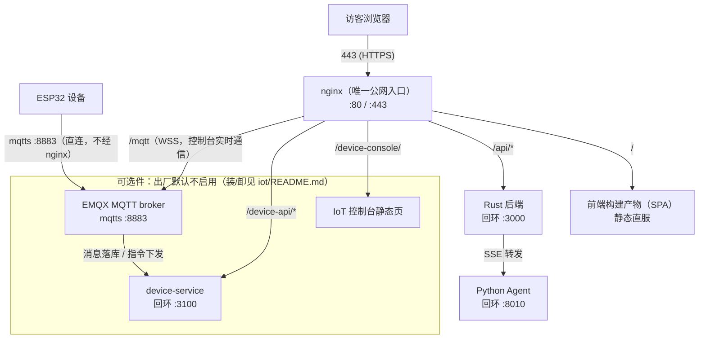

# 部署与运维手册

> 单机部署：nginx 直接服务前端构建产物，API 反向代理到 Rust 后端，Python Agent 作为对话
> 服务的下游。整站可以跑在一台小型 VPS 上。
>
> 本文保留**设计判断与排障思路**；本站的具体服务名、路径、机器规格与可复制的运维命令属私有
> 运行簿，不进仓库。文中所有实测数字都标了口径，**换机器须重测**。

---

## 1. 架构拓扑与端口



> **设备那条线不经过 nginx**：ESP32 直接连 EMQX 的 8883（唯一对公网开放的设备端口）。
> nginx 只在控制台要实时推送时终结一条 WSS，转给 EMQX 的 `127.0.0.1:8083`——两者别画成
> 一条边，否则会以为"设备接入也走 443"。
>
> 这张图原来是手画的字符图，中文注释宽度按 2 列算、稍有编辑就错位；换成 mermaid 之后
> 分支再多也不会散。同类的还有 [iot-device-integration.md](iot-device-integration.md)
> 的平台架构图与指令回执闭环图。

| 端口 | 进程 | 说明 |
|---|---|---|
| 80/443 | nginx | 静态 + 反代 + SSE 透传（`X-Accel-Buffering: no`，否则帧被缓冲成一次性返回） |
| 3000 | Rust 后端 | axum + sea-orm + MySQL；博客主 API + 对话编排 |
| 8010 | Python Agent | FastAPI，4 workers（20261002 起，见《资源画像与容量》）；对话生成 + 工具执行 + RAG |
| 3100 | IoT 设备服务 | Rust；设备注册/遥测/cmd 下发（校验博客 JWT） |
| 8883 | EMQX | MQTT over TLS；设备 ↔ device-service 消息总线 |
| 3306 | MySQL | 博客业务库 + 对话历史 + IoT 数据 |

**除 nginx 外全部只绑回环**——这是整套信任模型的基石，边界细节与实测命令见
[security-boundary.md](security-boundary.md)。依赖：MySQL 8、EMQX（MQTTS 证书与 nginx 侧同源
双副本，续期要两处同步）。

---

## 2. CI/CD 部署链路

### 2.1 流水线（GitHub Actions）

push 到 `cn_sora_blog` 分支触发构建与部署：

```
源码 → [云端] cargo build --release（Rust 二进制）
     → [云端] vite build（React → dist）
     → [云端] 打包（二进制 + dist）→ 上传对象存储中转桶（R2）
              按提交号归档：deploy/<sha>/deploy.tar.gz
     → [云端] SSH 触发服务器上的部署脚本，并等它结束（退出码 = 部署结果）
     → [服务器] 下载解压 → 替换二进制 → 源码有变才重启 Rust 服务
     → [服务器] dist 解压到位 → nginx 直接服务新文件（无需重启）
     → [服务器] 写 frontend/dist/build-info.json（sha + 部署时刻）
     → [服务器] 清理中转桶，只留 latest.txt + 最近 3 个提交包
```

几个容易踩的点，都是量过或翻过车才定下来的：

- **按提交号归档，不是所有人共用一个键**。早先两次构建共用一个 R2 键，"部署哪一版由谁上传得晚
  决定"——实测较新的 run 先上传、把较旧那个含二进制的包覆盖掉，较旧那个随后部署拉到的却是较新的
  包 ⇒ **它自己的后端那一半从未落地**，而两次 CI 都是绿的（旧触发是 `nohup … &` 直接放走，
  部署结果 CI 不知道）。现在 `deploy/<sha>/deploy.tar.gz`，且 CI **等部署脚本的退出码**——
  所以 **CI 绿灯 = 真部署成功了**，不是"构建过了"。
- **同分支的 run 串行化**（`concurrency` + `cancel-in-progress: false`）：后来的排队等前一个，
  不打断正在跑的部署。
- **重启是有条件的**：仅当 `git diff <上一版 sha> <本次 sha> -- src Cargo.toml Cargo.lock`
  有变化（或存活探测发现后端已经不在响应）才 `systemctl restart`；只改前端的提交不重启后端。
- **只改测试/文档的 push 会"绿灯但什么都没部署"**：部署过滤器看的是**本次 diff**，若本次没有
  可部署的变化，该 run 直接跳过部署——所以管线另留了 `workflow_dispatch`（手动触发，恒跑）
  用来补跑。遇到"推了却什么都没上线"，先看是不是这个原因，再用 `build-info.json` 里的 sha
  确认线上到底停在哪一版。
- **回滚**：中转桶里保留最近 3 个提交包（`prune_r2.py --keep 3` 在部署成功后执行）。
  回滚就是点名一个旧 sha 重跑部署脚本：

  ```bash
  DEPLOY_SHA=<旧提交号> bash scripts/deploy/deploy_from_r2.sh
  ```

  被清理掉的包取不回来，只能重跑 CI 用那个提交号重建。看一眼保留了哪些：
  `python3 scripts/deploy/prune_r2.py`（默认只列不删）。

三条判断，都是量过才定的：

- **为什么在云端构建**：`vite build` 的堆需求可达约 3GB，与常驻服务同机并发时会 OOM 拖垮整机
  （本项目在小内存机器上真翻过一次车，服务器重启了 5 分钟）。所以本地只做 `cargo check` 级别的
  轻量验证，真正的构建交给 CI runner。
- **为什么中转桶不当静态直服**：测速定论——R2 跨境 TTFB 0.7–1.3s，而服务器骨干网出站是毫秒级；
  3M 出站带宽下本地直服仍是正解。对象存储在这里承担的是「云端产物 → 服务器」的搬运，不是 CDN。
- **密钥全走 CI Secrets 与服务器环境文件**，无硬编码。

**前端强缓存**：对少量重资源目录（Live2D 模型与运行时）设 1 年 `immutable`；该 location 必须排在
`\.(js|css|json)$` 的 no-store 正则**之前**（否则被后者的规则吃掉）。这类目录换版靠 `?v=` bump，
同步点不止一处；完整清单见 [frontend/README.md](../frontend/README.md) 的《改这里的文件要 bump 版本号》
一节（那是唯一事实源，本文不另列一份以免漂移）。

### 2.2 逃生通道（仅 CI 故障时）

服务器上保留一条「本地打包 → 上传中转桶 → 服务器部署」的手动路径，供 CI 不可用时救急。**它会在
服务器上触发构建，是已知风险，只在 CI 挂掉时用**；具体命令见私有运行簿。

### 2.3 硬性约定

- **本地不编译、不手动构建**（原因见 §2.1 那次 OOM）。
- **本地验证用轻量命令**：前端不构建、直接 push 等 CI；后端只 `cargo check`。
- **严格自检是本地纪律，不是 CI 门槛**：`RUSTFLAGS="-D warnings" cargo check`——CI 未设这条，
  warning 不会挂构建；unused import 之类提交前自己清掉。

---

## 3. 服务管理（systemd）

六个 systemd 单元，均开机自启（后两个是**可选件**，见 [iot/README.md](../iot/README.md)）：

| 服务 | 重启策略 | 说明 |
|---|---|---|
| nginx | 发行版默认 | 静态根 `frontend/dist` + 反代 3000/8010/3100；**配置改动只需 `reload`** |
| Rust 后端 | `Restart=always` | 工作目录即仓库根，环境文件由 dotenv 从工作目录加载 |
| Python Agent | `Restart=always` | uvicorn 4 workers 绑回环（20261002 起）；`TimeoutStopSec=120` 让在途对话优雅结束 |
| MySQL | 发行版默认 | 业务库 + 对话历史 + IoT 数据（单实例，无主从） |
| EMQX | `Restart` + `RestartSec=5s` | MQTT broker；**带内存上限**（drop-in 见下） |
| IoT device-service | `Restart=on-failure` | 独立目录与独立仓库，不在博客仓库内 |

- **EMQX 要有 systemd drop-in 内存上限**（`emqx.service.d/memory-limit.conf`）：
  `MemoryHigh=384M`、`MemoryMax=512M`。**这个值只存在于服务器上**——仓库里看不见它，改机器
  或重装时容易漏掉 ⇒ 在这里记一份，实测常驻约 42–65MB（见 §8）。没有上限时 EMQX 会在
  broker 压力下一路涨到把整机拖垮，而它只是一个可选件。

- **agent 无状态，重启安全**：改技能/工具/prompt 后**必须重启才生效**——push 不等于部署
  （CI 只做校验，运行时是另一件事）。
- **勿再 nohup 裸跑** Rust/agent（历史遗留习惯）：会与 systemd 抢端口，而且重启后无人拉起。
- `Restart` 计数就是崩溃次数，`systemctl status` 看它比翻日志快。
- 二进制替换由部署脚本完成（`cp → chmod +x`，之后**源码有变才** `restart`，见 §2.1）；前端
  dist 解压即生效，不必重启 nginx。
- ⚠️ **部署脚本执行中不要去改它**：bash 按字节偏移增量读脚本文件，改到一半会读到半截（先
  `pgrep -af deploy_from_r2` 确认没有部署在跑）。

---

## 4. 日志体系（分组规范）

`logs/` 是集中日志区，按组分层：

```
logs/
├── rust.log            # Rust：全局 access 行（method= path= status= ms=）+ 业务日志
├── agent/              # agent.log 生命周期（tid= trace_id 前缀）
│   └── traces/         # 对话 trace JSON，按天分目录 <YYYYMMDD>/（节点事件 + 分段耗时 + 退出原因）
├── frontend/           # monitor.log 前端错误上报（匿名可写，8KB body 上限）
├── device.log          # IoT device-service
├── deploy.log          # CI 触发记录
├── health.log          # 心跳探针告警
└── archive/            # 历史归档
```

- **轮转**：daily + rotate 14 + compress + copytruncate（追加写，免重启），glob 覆盖各组。
  ⚠️ **必须指定 `su ubuntu ubuntu`**：日志属主得是跑服务的那个用户，systemd 迁移后 root 属主
  会让轮转**静默失败**（20260830 踩过，chown 修正）。
- **traces 不归 logrotate 管**：对话 trace 是**文件名唯一的一次性 JSON**，而 logrotate 的 `rotate N`
  靠同名文件后缀 +1 计数，对这类文件完全无效（配置写了 `rotate 14`，实测最老文件 26 天、
  `.2.gz` 为 0 个）。该块 20260925 已整块删除；保留期改由 **agent 仓的**
  `saudade-blog-agent/eval/trace_retention.py` 执行
  （按 mtime：>24h 压缩、>30 天删除；默认只列不删、`--apply` 才动手；已接进 **agent 仓的**
  `saudade-blog-agent/scripts/nightly_regression.sh` 末位）。
- **时区**：Rust 与 agent 日志统一本地 +08:00 钟面，跨文件对账没有 8 小时差。
- **心跳探针**（建议由 cron 周期执行，`scripts/healthcheck.sh`，共 **6 段**）：① Rust 存活
  ② agent `/health` 的 `agent_ready` ③ **uvicorn worker 崩溃检测**（pid 集合对比——worker
  静默死亡不留任何日志，2026-08-29 事故根因）④ nginx error.log 增量扫描 ⑤ 残留无头浏览器清理
  ⑥ **夜间任务失败哨兵**（20260924 加：夜间套件非零退出/未跑 ⇒ WARN）。异常追加 `health.log`。
  装上就是一行 cron（探针只写日志，不发通知——**告警投递需要自己接**，见《已知缺口》）：

  ```
  * * * * * /path/to/Saudade-Blog/scripts/healthcheck.sh >/dev/null 2>&1
  ```
- **排障首选 trace**：对话异常直接读 trace 的分段耗时（planner / execute / model / gate），
  比翻日志快得多。

---

## 5. 配置面（说什么，不说值）

| 配置面 | 承载什么 |
|---|---|
| Rust 环境文件 | 数据库连接串（含 `timezone("+08:00")`）、`JWT_SECRET`、agent 地址、模型 API key |
| Agent 环境文件 | LLM provider/model、思考开关、trace 目录、代签 IoT JWT 的密钥 |
| device-service 环境文件 | MQTT broker、日志文件、JWT 校验侧配置 |
| nginx 站点配置 | 443 两个 server（主域 + 泛域）、缓存与 SSE 透传规则 |

约定：模板进仓库（`.env.example`），真值只在服务器上。**别在 sites-enabled 里放备份文件**——
nginx 会把它们一起加载，导致 duplicate server；备份移出该目录。

两条与首页图谱产物相关的部署注意（20261003 起）：

- 后台重建出来的产物写在 **agent 仓**的 `data/word_graph/web/`，由 Rust 的
  `GET /api/public/graph/{manifest,artifact/:file}` 供出，默认路径写死在
  `src/routes/graph.rs::artifact_dir`（agent 仓不在默认位置时用 `GRAPH_ARTIFACT_DIR` 改）。
  **它不在 `frontend/dist` 里**，所以部署管线不会碰它，重建完刷新首页即生效。
- `^~ /api/` 前缀 location 会跳过所有正则 location ⇒ `/api/public/graph/artifact/graph-xxx.js`
  的 `Content-Type` 与 `Cache-Control` 完全由 Rust 决定。**日后加正则 location 时别让它匹配
  `/api/...js`**：一旦抢在前面，产物的 `text/javascript` 与一年 immutable 会一起失效
  （症状是类型变成 `text/html` 或被 no-store，页面看着正常、只是每次刷新全量重下）。

---

## 6. 故障排查手册

| 症状 | 排查路径 |
|---|---|
| 对话无响应/卡死 | ① agent `/health`（`agent_ready`？）→ ② agent 日志的生命周期行（end reason：超时/断连/错误）→ ③ trace 分段耗时（模型慢？工具挂？）→ ④ `grep 慢调用` |
| 页面白屏/看板娘不出现 | ① nginx error.log（探针已盯）→ ② 前端 monitor.log 的 js_error/fetch_fail → ③ `?v=` 没同步、浏览器吃了旧缓存 |
| Rust 崩溃自愈但反复重启 | `systemctl status` 的 Restart 计数 + rust.log 尾部（panic / DB 连接失败） |
| 设备离线/指令无效 | ① device-service 日志（入队→发出→broker 确认三段）→ ② EMQX 状态 → ③ 设备端 cmd_history 回执（req_id 对账） |
| worker 静默死亡 | health.log 的 pid 对比告警 + uvicorn master 进程树（worker 是 `spawn_main` 子进程） |
| 日志不轮转 | 查属主（必须是跑服务的那个用户）+ `logrotate -d` 干跑验证 |

**四端日志对账**：`trace_id`（`X-Request-Id`）贯穿 前端 → Rust → Python → device-service → ESP32
回执，一个 id 串起全部端日志——排障先按 trace_id 找全链路，再谈别的。

---

## 7. 安全要点

- **登录密码 Argon2id**（PHC 串 + 随机盐，OWASP 推荐档参数）；旧的无盐 SHA-256 只作**兼容校验**，
  登录成功后惰性升级该行——当初为了不把存量账号锁在门外才这么设计。
- JWT HS256（`sub` = 用户 id）；**服务间另有身份断言**：Rust 以同一密钥签一条 60 秒短时效、
  `aud=agent` 的断言放请求头，agent 验签后**覆盖请求体里的 `user_id`**——身份边界从「只听回环」
  挪进了签名里（见 [security-boundary.md](security-boundary.md)）。
- 前端错误上报端点匿名可写（访客错误上报最有价值），防刷靠 8KB body 上限 + logrotate 兜底磁盘。
- IoT API 全部校验博客 JWT（控制台复用前端已有 token，无二次登录）。
- 中转桶密钥与模型 API key 均从 CI Secrets / 环境文件注入，无硬编码；泄漏过的密钥已滚动。

---

## 8. 资源画像与容量（本站实测 · 示例部署）

> 这一节的数字全部来自**本站实测**（命令附在每张表后），不是估算；引用时请连着日期一起引，
> **换机器后必须重测**。示例部署把"生产服务"与"同机上的开发工具"分开列——混在一起看会得出
> "内存不够"的错误结论。

### 8.1 机器规格（示例部署）

一个小型单机 VPS：**4 vCPU / 3.7 GB 内存 / 40 GB 盘，无 GPU**。下面所有数字都是在这个规格上
量的（最近一次重测 **20261004**）；你的机器大概率不同，**先按同一组命令量一遍自己的**，
再决定要不要照抄这里的取舍。

```bash
nproc; grep -m1 'model name' /proc/cpuinfo; free -m; df -h /; cat /proc/loadavg
```

### 8.2 常驻内存（生产服务）

按 systemd cgroup 口径（`MemoryCurrent`，共享页只算一次）：

| 服务 | 常驻 | 波动 |
|---|---|---|
| Python Agent（master + 4 workers） | **~241 MiB（刚重启、worker 还凉着）↔ ~456 MiB（跑过一轮重活）** | ⚠️ 见下 |
| MySQL | ~90 MiB | 小 |
| EMQX | ~48 MiB | 42–65 MiB |
| Rust 后端 | ~15 MiB | 小 |
| nginx | ~8 MiB | 小 |
| device-service | ~4.5 MiB | 小 |
| **生产合计** | **~410 MiB（凉）↔ ~620 MiB（热）** | — |

**Agent 是大头，而它的形状是"1 + 4"，并且这一行是唯一会大幅摆动的**：master ~11 MiB + 4 个
worker，**worker 的 RSS 取决于它已经 import 了多重的模块**——刚起来、只答过轻请求时实测
57–77 MiB（20261004 复测更凉：4 个 worker 各 32–42 MiB、合计 241 MiB）；跑过检索/向量相关
路径（jieba 词典、numpy/scipy，乃至建图那条路上的 umap/numba）之后会涨到 130 MiB 以上
（合计 ~456 MiB 那次就是这么来的）。所以：

- **单 worker 的容量按 130 MiB 估**（结论偏保守，不会低估）；
- ⚠️ **引用这张表时必须说清"什么时候量的、那台机器刚重启过没有"**——同一台机器上
  agent 一行能从 241 飘到 456 MiB，**这不是"数字过时了"，是同一口径下的两个真实状态**。
  想比对自己机器，先 `systemctl restart saudade-agent` 再量一遍才是可比的口径；
- cgroup 的合计口径含共享页与文件缓存，与"逐进程 RSS 相加"本来就不是一个数，
  **别把两者混着引用**。

这就是 §3 里 worker 数的取舍依据：**每加一个 worker 按 +130 MiB 估**（2 → 4 约 +260 MiB
的上界），在 3.7 GB 机器上不算小数目，但对照下面 8.3 的开发工具占用，它并不是压力来源。

```bash
for s in saudade-agent saudade-rust nginx mysql saudade-device emqx; do
  echo "$s $(systemctl show $s -p MemoryCurrent --value)"; done
# worker 逐个看（worker 是 master 的 spawn_main 子进程，按 cmdline 匹配不到）：
m=$(pgrep -f "[u]vicorn server:app" | sort -n | head -1)
for p in $(pgrep -P "$m"); do tr -d '\0' < /proc/$p/cmdline | grep -q multiprocessing-fork \
  && echo "worker $p $(awk '/VmRSS/{print $2, $3}' /proc/$p/status)"; done
```

### 8.3 真正的内存压力来自"同机开发"

`free -m` 里 `used` 看起来有 2.2 GB（另有页缓存约 1.6 GB，随时可回收），但其中
**VS Code server 那一棵进程树（含其下的扩展进程）实测约 1.34 GB**（23 个进程 RSS 相加），
再加上同时跑着的测试进程（一次 golden 全量约 0.15 GB）——**都不是生产服务**。也就是说：

- **纯生产占用 ≈ 0.4~0.6 GB**（区间来自 §8.2 那个"agent 凉 ↔ 热"的两端），在 3.7 GB
  机器上余量充足；
- 紧的时刻只出现在"开发者登录、IDE + 对话会话常驻，同时跑测试/构建"时——这才是历史上那次
  OOM（§2.1）的真正形状，也是"本地不 build"纪律的由来。**它约束的是构建，不是 worker 数。**

### 8.4 磁盘画像

| 目录 | 大小 | 说明 |
|---|---|---|
| `target/` | 4.1 GB | Rust 构建产物。**生产二进制就在这里 ⇒ 永不 `cargo clean`** |
| `saudade-blog-agent/` | 249 MB | 含 `.venv` |
| `logs/` | 97 MB | agent 日志 + trace（按天删/压，见 §4） |
| `/usr/lib/emqx` | 89 MB | EMQX 发行包（可选件） |
| ESP32 固件源码仓（在仓库外） | 70 MB | 开发产物，非运行依赖 |
| `frontend/dist` | 18 MB | 前端产物 |
| device-service 源码目录（在仓库外） | 14 MB | 含它自己的 `target/` |
| `/var/lib/emqx` | 1.4 MB | EMQX 运行数据 |

40G 盘已用 81%（约 31G）：**4 GB 的 `target/` 与 89 MB 的 EMQX 是两块可辨认的大头，但都不能
随手删**（前者是生产二进制，后者是可选件的本体）。清理口径与踩过的坑记在 agent 仓的
`docs/问题记录.md`；**增长最快的通常是 `logs/` 与 trace，先看 §4 的保留策略是否在跑**。

```bash
du -sh target logs frontend/dist saudade-blog-agent /usr/lib/emqx /var/lib/emqx
```

### 8.5 负载画像（对话侧）

按天对话轮数（trace 按天目录计数，**这张表每天都在长，引用请连日期一起引**）——
截至 20261004：`20260925:15 / 26:74 / 27:41 / 28:13 / 29:30 / 30:120 / 20261001:60 / 02:22 / 03:7`
⇒ **常态十几到几十轮/天，记住的峰值 120**（个人站点的量级，不是压测数字）。单轮耗时
（近 45 轮，含工具调用）：

| 指标 | 值 |
|---|---|
| 耗时 | mean 10.7s / p50 9.6s / p90 22.3s / max 28.5s |
| 每轮 prompt tokens | mean 71.7k / p50 62.8k / p90 114k / max 195k（其中 37.6% 命中 cache read） |
| 每轮输出 tokens | mean 345 / p90 833 |
| planner / narrator 调用次数 | 1.60 次 / 0.89 次（单次 prompt 分别 ~37k / ~12k） |

**口径注意**：token 字段是 20261001 起才写进 trace 的，所以 token 那一行只有 45 轮的样本
（耗时那几行样本更大：n≈450，p50 6.8s / p90 17.0s / max 44.2s）。**这两组数别混着引用。**

```bash
python3 - <<'PY'
import json,glob,statistics
rows=[]
for f in sorted(glob.glob('logs/agent/traces/202610*/[0-9]*.json')):
    d=json.load(open(f)); tot=out=p=n=0
    for e in d.get('events') or []:
        if e.get('event')=='llm_done':
            i=(e.get('input') or 0)+(e.get('cache_read') or 0); o=e.get('output') or 0
            if e.get('node')=='planner': p+=1
            else: n+=1
            tot+=i; out+=o
    if p+n: rows.append((d.get('duration_s') or 0,tot,out,p,n))
q=lambda a,k: sorted(a)[min(len(a)-1,int(len(a)*k))]
print('n=%d dur p50=%.1f p90=%.1f | prompt mean=%.0f p90=%.0f | out mean=%.0f'%(
  len(rows),q([r[0] for r in rows],.5),q([r[0] for r in rows],.9),
  statistics.mean([r[1] for r in rows]),q([r[1] for r in rows],.9),
  statistics.mean([r[2] for r in rows])))
PY
```

### 8.6 并发能力（`/health` 压测）

`/health` 是纯内存响应，测的是 **worker 数带来的并发上限**（对话是流式 + 等 LLM，瓶颈在外部
API 不在服务器上，不要用对话压这一项）：

| 并发 | 2 workers（旧） | 4 workers（20261002 起） |
|---|---|---|
| 8 | 499 req/s（p50 7ms） | **795 req/s**（p50 4.5ms / p90 10.1ms） |
| 32 | 784 req/s（p50 37ms） | **1174 req/s**（p50 16.9ms / p90 36.2ms） |

⇒ 4 workers 在同等并发下 **+50%~59% 吞吐、延迟减半**，代价按上界算是 +260 MiB 常驻
（2 → 4 个 worker；实际涨幅取决于各 worker 加载了多少重模块，见 8.2）。
对这个站点的流量（8.5 的十几到几十轮/天）而言，**4 workers 的余量极大**——加它是为了扛突发
（多人同时开对话）与单 worker 假死时的降级，不是日常需要。

### 8.7 规格建议

- **现状够用**：CPU 几乎全闲（load < 0.5），生产内存 0.4~0.6 GB / 3.7 GB，服务端不是瓶颈。
  真正的瓶颈是**外部 LLM API 的延迟**（单轮 p90 22s 里绝大部分是模型时间）——**换更大机器
  不会让对话变快**。
- **升级优先级：内存 > 磁盘 > CPU**。
  - 内存（3.7 GB → 8 GB）：唯一的实际收益是"能在这台机器上跑构建/测试"与容纳更多开发工具；
    如果开发环境另置，2 GB 都够跑生产。
  - 磁盘（40 G，81% 已用，约 31 G）：`target/` 占 4 GB 且不许删，`logs/` 是持续增长项；
    再加一块盘或扩到 80 G 更稳妥。
  - CPU：**不需要**。4 vCPU 在 load 0.3 下长期空转。
- **纪律不变**：本地不 build（`vite build` / `cargo build --release` 会 OOM）；worker 调到 4 之后
  依然要盯 `free -m`——但压力来源是开发工具，不是服务本身。
- **若要再提并发**：先加 worker（按 +130 MiB 一个的上界估）比升级机器便宜得多；
  16 线程 executor 未跑满。

### 8.8 备份、恢复与已知缺口

这一节列的是**本项目目前没有做**的运维事项——写出来是为了让接手的人知道边界在哪，
不是待办清单：

- **数据库没有备份脚本，也没有恢复步骤**：只有一个从零建库的 `scripts/migration/fresh_install.sh`。
  生产库是单实例、无主从；`mysqldump` 需要自己安排（定时 + 异地存放），**恢复演练也从未做过**。
- **没有整机灾难恢复预案**：重启后 MySQL → EMQX → rust/agent 的启动顺序靠 systemd 依赖，
  从未在"冷启动"场景下演练过。
- **探针只写日志、不发通知**：`health.log` 里攒着告警，但没有人会被叫醒。
- **依赖漏洞响应**：仓库没有 `dependabot.yml`，CI 里也没有 `cargo audit` / `pip-audit` 这类步骤。
- **密钥轮换流程**：`JWT_SECRET` 换一次等于所有人重新登录（旧令牌立即失效），但**没有成文的
  轮换周期与泄漏处置步骤**；其余凭据（中转桶、模型 API key）只在泄漏后被动滚动过。
- **没有漏洞披露政策与安全联系人**（仓库里没有 `SECURITY.md`）。
