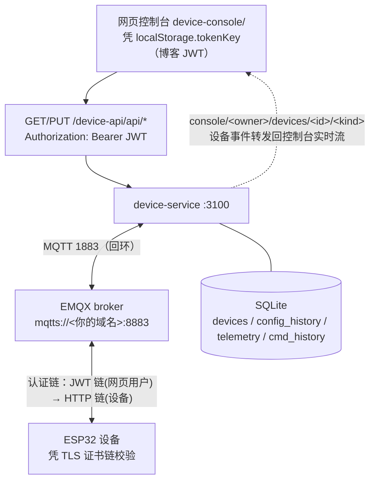
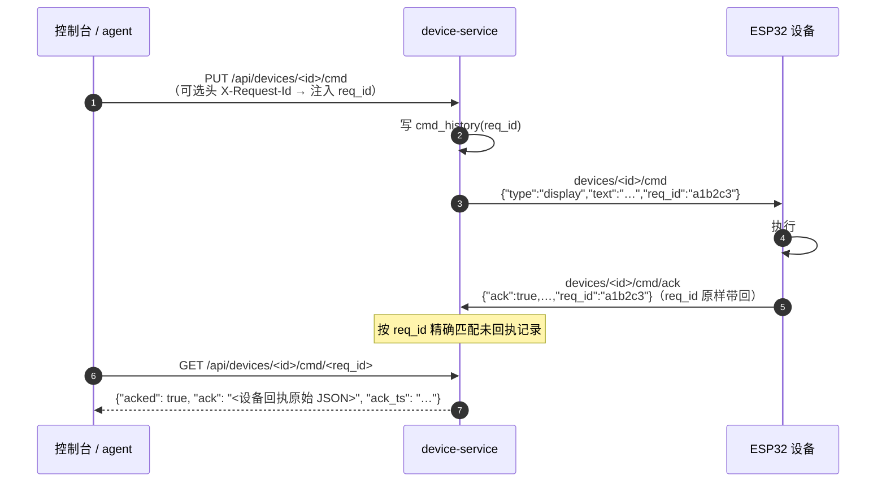

# IoT 设备接入物联网平台指南

> 平台 = 本站的 IoT 能力：设备注册/参数配置/指令下发/遥测/在线状态/OTA。
> **这是可选件，出厂默认不装**——装/卸的三处开关、目录与脚本见 [iot/](../iot/)。
> 架构：nginx（`/device-api` 反代 + `/device-console` 静态）→ **device-service**（Rust, :3100，
> 业务 API + MQTT 桥）→ **EMQX**（MQTT broker）→ **ESP32 等设备**。
> 控制台：https://saudade.site/device-console/（复用博客登录态，无二次登录）。
> 设备参考实现：[BigLeopardCat/ESP32-S3-OBC](https://github.com/BigLeopardCat/ESP32-S3-OBC)
> （**另一个仓**，实际在跑的固件在那儿）；本仓 [iot/firmware/](../iot/firmware/) 是抽出来的
> 最小骨架与接口说明。
>
> ⚠️ 文中 `<你的域名>` 是占位，换成你自己的域名（与站点证书一致）。作者的线上演示站是
> `saudade.site`——凡是"照着填进你自己环境"的值都写成了占位，凡是能直接对着演示站跑的
> 复现命令才留着真域名。

---

## 1. 平台架构




**两种接入身份**，凭据体系互不相通：

| 身份 | 凭据 | 用途 |
|---|---|---|
| **网页用户** | 博客 JWT（Bearer/密码） | REST API（设备管理/下发/OTA 管理）+ 控制台实时流（MQTT WSS） |
| **设备** | `device_id` + `device_key` | MQTT 接入（用户名/密码）+ OTA 拉取（HTTP Basic） |

**三条通道**：

| 通道 | 地址 | 设备用 | 网页用 |
|---|---|---|---|
| MQTT | `mqtts://<你的域名>:8883`（TLS） | ✅ 指令/配置/遥测/状态 | 控制台实时流（WSS /mqtt） |
| REST | `https://<你的域名>/device-api/api/...` | OTA 轮询（Basic 认证） | ✅ 全部管理 API（JWT） |
| 控制台 | `https://<你的域名>/device-console/` | — | ✅ 人机交互 |

---

## 2. 快速接入流程（5 步）

1. **注册设备**：控制台"注册设备"按钮（或 `POST /api/devices`）→ 获得一次性凭据：
   ```json
   {"device_id": "dev-<uuid32>", "device_key": "dk-<uuid32>", "note": "device_key 仅显示一次，请写入固件并妥善保存"}
   ```
   ⚠️ `device_key` 只返回这一次，丢失只能删除重建设备。
2. **填入固件**：把 `device_id`/`device_key` 写入固件配置（参考实现：`main.c` 顶部宏）。
3. **连上 MQTT**：`mqtts://<你的域名>:8883`，用户名=`device_id`，密码=`device_key`，
   校验服务器证书链（正式证书）。
4. **订阅/上报**：订阅 `devices/<id>/config`、`devices/<id>/cmd`；发布遥测、状态、回执。
5. **验证**：控制台看到设备上线 → 下发一条显示指令 → 设备执行 + 回执 ✓。

---

## 3. MQTT 协议定义

### 3.1 Broker 与认证链（EMQX 5.8.9）

| 监听 | 地址 | 用途 |
|---|---|---|
| MQTTS **8883** | 公网 | **设备接入**（TLS，正式证书，与 HTTPS 同源） |
| TCP 1883 | 仅回环 | device-service 内部连接 |
| WSS 8083 | 仅回环（nginx /mqtt） | 控制台实时流 |
| Dashboard **18083** | 仅回环 | EMQX 自带管理台；**别挂公网**（明文 HTTP + 单一口令） |

> **看 Dashboard 走 SSH 隧道**：`ssh -L 18083:127.0.0.1:18083 <服务器>` 再开
> `http://127.0.0.1:18083`。登录口令不在仓库里——`iot/emqx/configure_emqx.py` 首跑时
> 会轮换管理员口令并把新口令与 API Key 落盘到 `iot/emqx/.admin_creds`、`.api_key`
> （0600、已 gitignore）；**只有这两个文件丢了才需要重跑脚本**（见 `iot/emqx/README.md`）。

认证链（顺序匹配）：
1. **JWT 认证链**（网页用户）：password = 博客 JWT，HMAC 校验（secret = 博客 `JWT_SECRET`）
2. **HTTP 认证链**（设备）：回调 `POST http://127.0.0.1:3100/api/devices/auth`，
   body `{"username": ..., "password": ...}`——设备凭证正确 → `allow`；未知 → `ignore`
   （继续认证链，**绝不能 deny**，否则把 MQTT 死锁在自定义逻辑上）
3. 内部账号 `svc`（设备服务自身，superuser）

**ACL**（`no_match=deny` 默认全拒，内置规则）：

```
broadcast/#               # 所有
users/<username>/#        # 网页用户（username=sub）
devices/<username>/#      # 设备（username=device_id）——设备只能碰自己的空间
console/<username>/#      # 网页用户实时流
```

设备（username=`device_id`）**只能访问 `devices/<自己>/#`**——ACL 层面隔离，跨设备不可达。

### 3.2 Topic 全表

设备前缀均为 `devices/<device_id>/`：

| Topic | 方向 | QoS | retain | Payload |
|---|---|---|---|---|
| `devices/<id>/config` | 服务→设备 | 1 | ✅ | `{"cfg_version": N, "config": {...任意 JSON}}` |
| `devices/<id>/config/ack` | 设备→服务 | 1 | 否 | `{"ack": true, "cfg_version": N}` |
| `devices/<id>/cmd` | 服务→设备 | 1 | ❌ | 任意 JSON（可带 `req_id`） |
| `devices/<id>/cmd/ack` | 设备→服务 | 1 | 否 | 执行结果 JSON，**必须原样带回 `req_id`** |
| `devices/<id>/telemetry` | 设备→服务 | 1 | ❌（必须非 retain） | 任意 JSON，**即心跳** |
| `devices/<id>/status` | 设备→服务 | 1 | online 可 retain | 字符串 `"online"` / `"offline"` |
| `console/<owner>/devices/<id>/<kind>` | 服务→浏览器 | 1 | 否 | 事件转发（telemetry/ack/status 分发） |

**retain 语义（两个坑，历史踩过）**：
- `config` **必须 retain**：设备上线即收到最新配置（配置自愈）。
- `cmd` **严禁 retain**：一次性动作，retain 会重放旧指令（曾导致 OLED"换内容无效"——重放旧指令覆盖新内容，见问题记录 2.5）。
- 遥测必须非 retain：retain 遥测会被当成心跳重放，破坏在线判定。

### 3.3 指令与回执（req_id 端到端闭环）



- 设备回执**缺失 req_id** 时，服务端退化为匹配最近一条未回执记录（兼容旧固件）。
- 回执也刷新在线心跳；`X-Request-Id` 头是 agent trace_id 透传链的一环（四端对账）。
- ⚠️ **本仓的固件模板没实现这条回执**（20261002 核实）：`iot/firmware/template_ESP32_OBC.ino`
  与 `template_ESP32_OBC_ESP_IDF.c` 只发布 `config/ack`（见各自的 `MQTT_TOPIC_ACK`），
  `handle_command` 执行完 display/restart/ota_check/gpio/beep 后**不回包**——两个模板、
  `iot/firmware/README.md` 的主题表、`固件开发指南.md` 都是如此。这是**模板的缺口、不是契约的错**：
  服务端正是靠上面那条 req_id 兜底才不至于卡死（`GET .../cmd/<req_id>` 会一直 `acked:false`，
  直到被环形 100 条挤掉）。ESP32 固件的**真相源在另一个仓**（`ESP32-S3-OBC`），
  仓内这两个文件是让人照着接的骨架；抄它们时**要自己补 `cmd/ack`**，别以为已经通了。

### 3.4 在线状态判定（防"假在线"）

- **心跳** = 非 retain 的真实遥测/回执（30s TTL 内刷新即在线）；`status=offline` 立即离线。
- retain 的 `status online` 订阅时被重放，**不计入心跳**——这是 2026-08-28"断电假在线"事故的
  修复核心（问题记录 2.1）：设备断电后 30s 内判定离线，下发返回 409 而非假成功。
- 正常掉线由**遗嘱消息**（last will，retain `"offline"`）自动补发；主动重启前可先发 offline。

### 3.5 遥测（即心跳）

示例（每 5-15s，字段自由扩展，控制台自动发现新列）：

```json
{"temperature": 26.5, "humidity": 60.2, "rssi": -72, "uptime": 12345,
 "firmware": "1.1.0", "cfg_version": 5, "free_heap": 184320}
```

- `firmware` 字段被平台自动记录到设备表（OTA 成功判定）。
- 遥测不进保留队列（环形缓存 200 条/设备），查询 `GET /api/devices/<id>/telemetry?limit=N`。

---

## 4. REST API 定义（均要求博客 JWT，`Authorization: Bearer <token>`）

### 设备管理

| 端点 | 说明 |
|---|---|
| `GET /api/devices` | 设备列表。字段：`id`/`name`/`config`/`cfg_version`/`cfg_acked_version`/`firmware_version`/`sync`（`synced`已回执/`pending`待确认/`none`未配置）/`created_at`/`online`（30s TTL 现算）。返回 `owner=自己 OR is_default=1` |
| `POST /api/devices` | 注册，body `{"name":"客厅 ESP32"}` → 返回 `device_id`/`device_key`（一次性） |
| `DELETE /api/devices/:id` | 删除（204；默认演示设备不可删） |

### 参数配置（版本化）

| 端点 | 说明 |
|---|---|
| `PUT /api/devices/:id/config` | body `{"config": {...任意 JSON}}` → `cfg_version` +1 → 写 `config_history`（保留 10 版）→ 发布 MQTT → 响应 `{"ok":true,"published":true,"cfg_version":N}` |
| `PUT /api/devices/:id/config/rollback` | 回滚上一版重新下发（版本继续 +1，不倒退） |

设备回执后 `cfg_acked_version` 更新，`sync` 变 `synced`——控制台据此显示"已同步 vN"。

### 指令

| 端点 | 说明 |
|---|---|
| `PUT /api/devices/:id/cmd` | body 任意 JSON 透传（**不允许空对象**，400）。**离线（30s TTL）返回 409**"设备当前不在线，指令未下发"，不发布。可选头 `X-Request-Id` → 注入 `req_id`。响应 `{"ok":true,"published":true,"req_id":...}`，写 cmd_history（环形 100 条） |
| `GET /api/devices/:id/cmd/:req_id` | 回执查询：`{"acked":true/false,"ack":"<原始 JSON>","ack_ts":...}`；无记录 404 |

### 遥测

| 端点 | 说明 |
|---|---|
| `GET /api/devices/:id/telemetry?limit=N` | limit 默认 50（clamp 1-200），时间倒序 `{"online":bool,"items":[{"ts","data"}]}` |

### OTA（固件管理）

| 端点 | 鉴权 | 说明 |
|---|---|---|
| `GET /api/ota/info` | **设备 Basic**（device_id:device_key） | `{"version":"1.3.0","md5":...,"size":N}`；无版本 `{"version":null}` |
| `GET /api/ota/fw/:file` | 设备 Basic | 固件下载（目录穿越防护） |
| `GET /api/ota/versions` | JWT | `{"current":"1.3.0","versions":[...]}` |
| `PUT /api/ota/firmware?version=1.2.0` | JWT + **role=admin** | 上传固件（body=原始 bin）→ 落盘 + 重建 `current.bin` 指针 |
| `PUT /api/ota/rollback` | JWT + admin | 固件回滚（current 指针切回上一版） |

设备轮询流：`GET /api/ota/info` → 版本不一致 → `GET /api/ota/fw/current.bin` → esp_https_ota 写入
A/B 分区 → 重启 → 遥测上报新 `firmware` 确认。

### EMQX 认证回调（无 JWT）

`POST /api/devices/auth`：`{"username","password"}` → 设备凭证正确 `{"result":"allow"}`；
`svc` 账号 `{"result":"allow","is_superuser":true}`；未知 `{"result":"ignore"}`。

---

## 5. ESP32-S3 接入示例（参考实现）

完整固件：[BigLeopardCat/ESP32-S3-OBC](https://github.com/BigLeopardCat/ESP32-S3-OBC)，
接入细节见该仓库的 `docs/device-integration.md`。

最小接入骨架（ESP-IDF）：

```c
// 1. 连接参数（控制台注册后填入）
#define DEVICE_ID  "dev-<uuid32>"
#define DEVICE_KEY "dk-<uuid32>"

// 2. MQTT 配置：TLS 证书链 + 用户名/密码 + 遗嘱
esp_mqtt_client_config_t cfg = {
    .broker.address.uri = "mqtts://<你的域名>:8883",
    .broker.verification.certificate = (const char *)saudade_site_ca_pem,  // 嵌入证书
    .credentials.username = DEVICE_ID,
    .credentials.password = DEVICE_KEY,
    .session.keepalive = 60,
    .session.last_will.topic = "devices/" DEVICE_ID "/status",
    .session.last_will.msg = "offline",
    .session.last_will.retain = true,
};

// 3. 连接成功：发 online(retain) + 订阅 config/cmd
// 4. 每 5s：发布遥测（即心跳，非 retain）
// 5. 收 config：应用 + NVS 持久化 + 回 config/ack（带 cfg_version）
// 6. 收 cmd：执行 + 回 cmd/ack（req_id 原样带回）   ← ⚠️ 仓内两个模板**都没做这一步**，见 §3.3
// 7. 每 6h：GET /api/ota/info（Basic 认证）→ 版本变化 → 拉 current.bin 升级
```

要点：遥测即心跳；回执必须带 `req_id`；config 保留策略与 cmd 禁 retain 的差异是平台语义核心。
**第 6 步是骨架里唯一一处"照着写还不够"的地方**——两个模板源码到此为止（只回 `config/ack`），
补 `cmd/ack` 需要自己加一个 `MQTT_TOPIC_CMD_ACK "devices/" DEVICE_ID "/cmd/ack"` 并在
`handle_command` 的各分支末尾 publish 带 `req_id` 的结果。

---

## 6. 运维注意

- **安全组**：公网需放行 8883（MQTTS）。REST 全走 443 无需额外放行。
- **证书**：MQTTS 证书与 HTTPS 同源（同一张证书覆盖你的域名），到期需续期并同步
  EMQX 的证书目录（20260831 已续期至 **2026-11-07**；nginx 侧另有一份同源副本，**续期要两处同步**）。
- **设备服务部署**：device-service 不在本仓库、不经 CI（独立目录），改动需手动
  `cargo build --release` + 重启 device 服务（3.7GB 机器注意内存）。
- **数据**：SQLite WAL（devices/config_history/telemetry/cmd_history），量小无需外部依赖。
- **日志**：`logs/device.log`（DEVICE_LOG_FILE 配置）；MQTT 三段式日志（已入队→发出→broker 确认）
  是排查"下发假成功"的第一入口（问题记录 2.2）。

---

## 7. 机器代价与保留结论（20261002 实测）

**结论：本站的 IoT 是"在用/偶尔用"，建议保留**——代价可量化且都很小，而拆掉它并不会让
主站变快（主站的瓶颈在 LLM API 延迟，不在这台机器）。下面是账，引用时连着日期一起引。

### 7.1 边际代价

| 项 | 实测（20261004 cgroup 口径） | 对比 |
|---|---|---|
| 常驻内存 | EMQX ~48 MiB + device-service **~4.5 MiB** ≈ **52 MiB** | agent 每加一个 worker 就是 ~130 MiB ⇒ **IoT 全量约等于 0.4 个 worker** |
| 磁盘 | `/usr/lib/emqx` 89 MB + `/var/lib/emqx` 1.4 MB ≈ 90 MB | 40G 盘上占 0.2%；开发侧源码 `mqtt-demo` 14 MB、固件仓 70 MB 不算运行依赖 |
| CPU | 空闲时 ~0（load 0.10/0.21/0.35 的机器上无可见贡献） | — |
| 公网面 | 多开 **8883**（MQTTS） | 主站只开 80/443；这是**唯一为设备开的口子**，安全组与证书都要单独管 |
| 运维面 | **两个不经 CI 的 unit**（emqx、saudade-device）；device-service 源码不在本仓，改动要手动 `cargo build --release` + 重启 | 主站两个服务都走 CI；这两件是"游离在流水线之外"的例外 |

> ⚠️ **device-service 那一行改过一次口径**：早先这里与
> [deployment-and-ops.md](deployment-and-ops.md) §8.2 都写 ~1 MiB，20261004 量到 **4.5 MiB**
> （4.7 MB，一个 Rust + SQLite + MQTT 客户端的常驻量级本来就该是这个数，1 MiB 更像"没量、
> 估的"）。**结论不受影响**：IoT 全量 52 MiB，对照 agent"凉 241 ↔ 热 456 MiB"的摆动
> ——它比 agent 自己的日常波动还小。
>
> **分母要连着状态引**：生产合计在 **~410 MiB（agent 刚重启）↔ ~620 MiB（worker 跑过重活）**
> 之间，所以"IoT 占几个百分点"这个数会随取样时刻在 **8%~13%** 之间变（52/620 与 52/410）。
> 表里那条"≈0.4 个 worker"用的是**上界 130 MiB/worker**，不受这个摆动影响，引用它更稳。

### 7.2 两个必须记住的运维风险（不是代价，是坑）

- **EMQX 的内存上限只写在 systemd drop-in 里**（`MemoryHigh=384M` / `MemoryMax=512M`），
  仓库里原本看不见——已在 [deployment-and-ops.md](deployment-and-ops.md) §3 记一份。
  重建机器时漏掉这个 drop-in ⇒ broker 在压力下无人刹车。
- **MQTTS 证书与 HTTPS 同源，续期要两处同步**：只续 nginx 侧 ⇒ 网页正常、**设备全掉线**，
  而且掉线的表现是"设备离线"不是"证书过期"，很容易查到错的方向。

### 7.3 什么时候才该拆

三条任一成立再动它，否则保留：① 长期（>3 个月）没有一台设备在线、也不打算再接；
② 需要用 8883 这个公网端口去换别的服务；③ 服务器要缩容到 2GB 以下（那时 90MB 磁盘与
52 MiB 内存才真正开始有意义——这个数在 3.7GB 上是零头，到 2GB 上就是 2.5% 的整机）。

### 7.4 怎么卸（分两档，别只做第一档）

```bash
# 第一档：主站侧关掉（控制台/API 入口消失，服务还活着）——三处开关见 iot/README.md
./iot/toggle.sh off
# 再把两份 .env 里的 IOT_ENABLED 删掉，重启 Rust 与 agent 两个服务
./iot/status.sh                            # 判据是内容不是状态码（卸载后 /device-console/ 仍是 200）

# 第二档：连 broker 与服务一起停
sudo systemctl disable --now emqx saudade-device
# 彻底清（可选）：删 iot/ 目录、/usr/lib/emqx、/var/lib/emqx、drop-in 与 8883 安全组规则
```

**两档的差别**：第一档做完之后前端三个入口（`/device-console/`、`/device-api/`、`/mqtt`）
与 agent 的工具面都没了，但 EMQX 仍在监听 8883 并占着内存；**只做第一档等于"看起来拆了，
其实没省资源"**（省的是 52 MiB 里的 device-service 那 4.5 MiB 与 agent 说真话的那点逻辑，
几乎为零）。[iot/README.md](../iot/README.md) 的《代价》一节是给"要不要装/要不要留"做决策用的短版。

> ⚠️ **别以为 `toggle.sh off` 一条就够**（脚本自己的头注与结尾都在说这件事）：
> 它**只动 nginx 那一面**。另外两处（Rust 读的 `.env`、agent 读的 `.env` 里的 `IOT_ENABLED`）
> 得手动改，而且**改完要各自重启**——Rust 那条管的是 `sitemap.xml` 列不列设备控制台，
> agent 那条管的是"被问到物联网平台时说真话还是说本站未部署"。三处不一致**不会报错**，
> 典型症状是"agent 带你跳一个 404"或"页面能开但 agent 说本站没有"；
> 核对用 `./iot/status.sh`（判据是**内容**不是状态码——卸载后 `/device-console/` 仍会
> 落进 SPA fallback 返回 200 的首页，见 [deployment-and-ops.md](deployment-and-ops.md)）。
