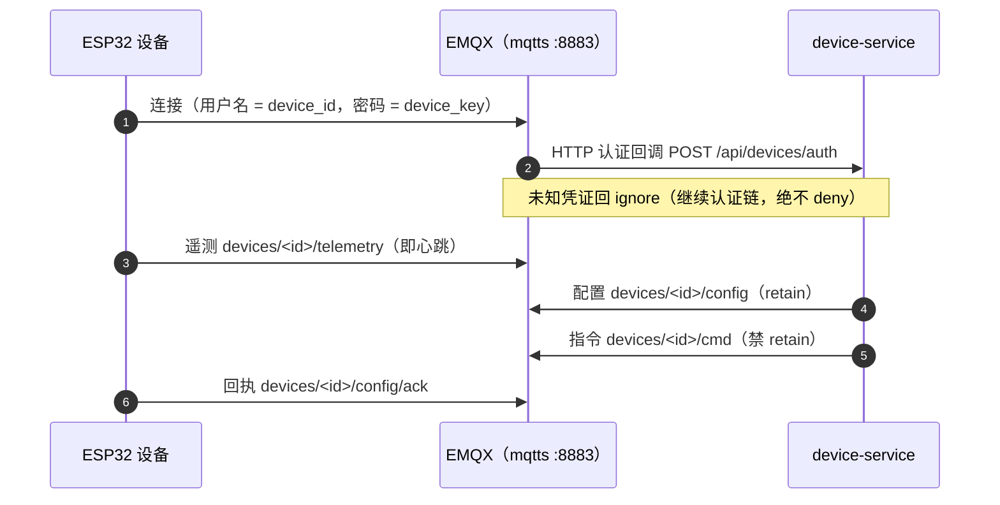

# ESP32 固件模板

设备侧要接上平台需要实现什么：[固件开发指南.md](固件开发指南.md) 是接口说明，
另外两份是同一条链路的两个可编译骨架——

| 文件 | 框架 |
|---|---|
| `template_ESP32_OBC.ino` | Arduino（PubSubClient + ArduinoJson） |
| `template_ESP32_OBC_ESP_IDF.c` | ESP-IDF（esp-mqtt） |

> **真相源不在本仓。** 项目作者实际在跑的那份固件在
> [BigLeopardCat/ESP32-S3-OBC](https://github.com/BigLeopardCat/ESP32-S3-OBC)，
> 本目录这两份是**从它抽出来的最小骨架**，用来让新设备照着接。两边会漂移，
> 以那边的实现为准。

## 用之前要改的

两份骨架都是**模板**，直接编译不会连上任何东西——顶部有一组 `#define` 要改：

```c
#define WIFI_SSID   "..."
#define WIFI_PASS   "..."
#define DEVICE_ID   "..."   // 控制台注册设备时返回（只显示一次）
#define DEVICE_KEY  "..."   // 同上；这是设备的口令，别进版本库
#define MQTT_HOST   "example.com"   // ← 改成你自己的域名（与站点证书一致）
```

`MQTT_HOST` 是这套东西里唯一与部署相关的值：MQTTS（8883）与 OTA 那两个 URL 都从它拼出来。
证书用的是站点证书，所以**必须填域名、且与证书的 CN/SAN 一致**——填 IP 会校验失败。

## 链路



主题里的 `<id>` 就是 `DEVICE_ID`，而 EMQX 的 ACL 把每个用户关在自己的命名空间里
（见 [../emqx/README.md](../emqx/README.md)）——所以设备读不到别人的主题，这是**服务端**
保证的，不靠固件自觉。

## 编译

两份骨架都不需要本仓的任何东西（不依赖仓库里的代码生成）。按各自框架的常规流程编即可
（Arduino IDE / `idf.py build`）。

⚠️ **别在跑着服务的机器上编**：大型构建会把上面常驻的服务一起拖垮。
ESP-IDF 尤其重，放到别的机器上编。
