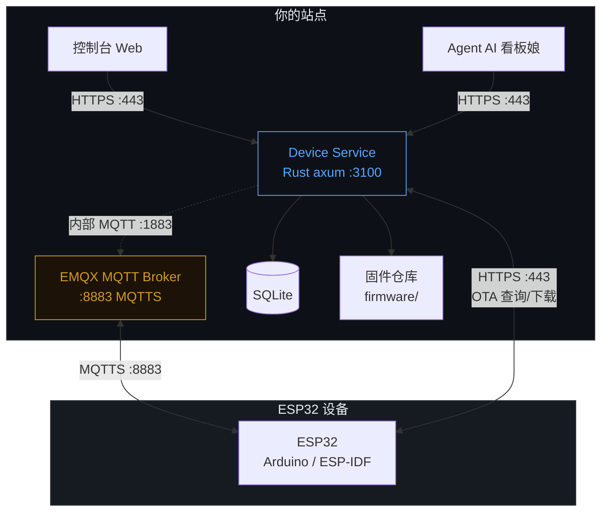
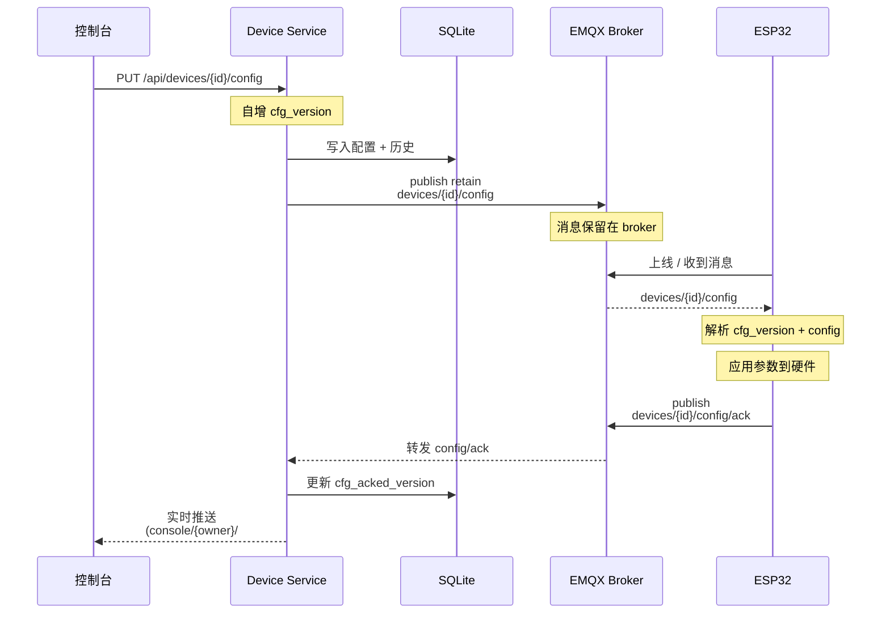
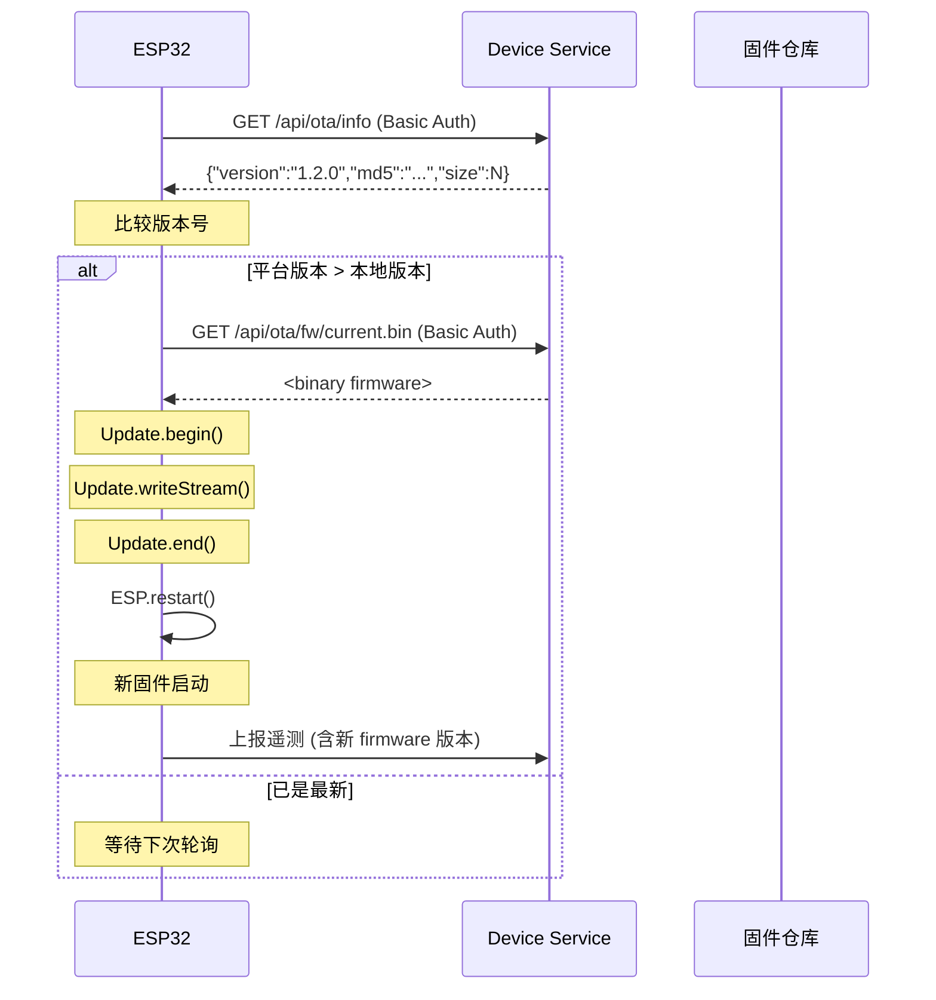
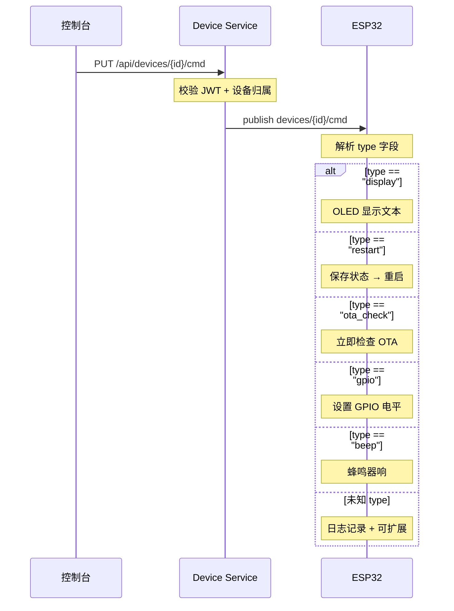

# OBC (One-Board Controller) 固件开发指南

## 概述

本指南面向 ESP32 开发者，说明如何基于平台 API 实现：

1. **遥测上报** — 设备向服务器发送传感器数据
2. **参数接收** — 设备接收服务器下发的 retain 配置
3. **固件升级** — OTA 远程固件更新
4. **指令接收** — 服务器下发的实时控制指令
5. **指令扩展** — 自定义新的控制指令类型

---

## 1. 通信架构



### 通信协议

| 方向 | 协议 | 端口 | 认证 |
|------|------|------|------|
| MQTT 数据流 | MQTTS | 8883 | `device_id` / `device_key` |
| OTA 查询/下载 | HTTPS | 443 | HTTP Basic Auth (`device_id:device_key`) |
| 控制台 WebUI | WSS | 443 | 博客 JWT（复用登录态） |

### MQTT 主题

| 主题 | 方向 | Retain | 说明 |
|------|------|--------|------|
| `devices/{id}/telemetry` | 设备→服务 | 否 | 遥测数据，15s 上报 |
| `devices/{id}/config` | 服务→设备 | **是** | 参数配置，设备上线即取 |
| `devices/{id}/config/ack` | 设备→服务 | 否 | 配置回执（含版本号） |
| `devices/{id}/cmd` | 服务→设备 | 否 | 一次性控制指令 |
| `devices/{id}/status` | 设备→服务 | 否 | online/offline 状态 |

> **重要**：`config` 主题使用 retain 标记，设备尚未上线时消息保留在 broker 上，设备一上线立刻收到。`cmd` 和 `telemetry` 不使用 retain，避免重连时重放旧指令。

---

## 2. 遥测上报

### 发送方式

MQTT 非 retain 发布到 `devices/{id}/telemetry`，建议周期 15s。

### JSON 格式

```json
{
  "temperature": 26.5,
  "humidity": 60.2,
  "rssi": -72,
  "uptime": 12345,
  "firmware": "1.0.0",
  "cfg_version": 5,
  "free_heap": 184320
}
```

### 字段说明

| 字段 | 类型 | 必选 | 说明 |
|------|------|------|------|
| `temperature` | float | 否 | 温度（℃） |
| `humidity` | float | 否 | 湿度（%RH） |
| `rssi` | int | 否 | Wi-Fi 信号强度（dBm） |
| `uptime` | int | 否 | 运行秒数 |
| `firmware` | string | **是** | 固件版本号（平台自动记录到设备列表） |
| `cfg_version` | int | 否 | 当前已应用的配置版本 |
| `free_heap` | int | 否 | 可用内存（字节） |

> **任意字段均可扩展**。平台不校验遥测字段格式，所有字段透传存储并显示在控制台遥测面板。遥测面板的列选择器**自动发现**新字段。

### 重要说明

- 遥测中的 `firmware` 字段会被平台自动解析并记录到设备信息中
- 遥测接收即视为"心跳"：设备在线状态刷新为 **30s** TTL（心跳 5s 一次；`ONLINE_TTL` 原为
  120s，2026-08-28"断电假在线"事故后收到 30s，见 agent 仓 `docs/问题记录.md` §2.1）
- 设备离线判定：30s 内无任何遥测/config/ack → 显示离线；或收到 `status: offline` 立即离线

---

## 3. 参数接收（retain 配置）

### 下发流程



### 协议格式

```json
{
  "cfg_version": 3,
  "config": {
    "brightness": 255,
    "default_text": "Hello OBC",
    "cooling_threshold": 80
  }
}
```

### 设备端处理步骤

1. 解析 `cfg_version` 和 `config` 对象
2. 从 `config` 中读取各参数值
3. 应用到硬件（如调整 OLED 亮度、风扇阈值等）
4. 发送配置回执（`config/ack`）

### 配置回执

```json
{
  "ack": true,
  "cfg_version": 3
}
```

### 在控制台查看

- 设备列表中显示当前配置版本号与同步状态
- 同步状态包括：`synced`（已确认）、`pending`（待确认）
- 实时消息流中显示 `config/ack` 事件

### 参数回滚

- 控制台支持回滚到上一版配置（版本号继续前进，不倒退）
- 每设备保留最近 10 版配置历史

---

## 4. 固件升级（OTA）

### 完整流程



### 设备端认证

OTA 查询和下载均使用 HTTP Basic Auth：

```
Authorization: Basic base64("device_id:device_key")
```

### 重要参数

- **轮询间隔**：6 小时（可调整为更短或在收到 `{"type":"ota_check"}` 指令时立即检查）
- **下载超时**：建议 30s 以上（大固件可能需更长时间）
- **版本比较**：固件模板使用字符串比较，生产环境建议使用 semver 库

### 固件文件命名

- 上传文件：`OBC-{version}.bin`
- 设备下载恒定 URL：`current.bin`（始终指向当前版本）

### 回滚

- 管理员可在控制台执行固件回滚
- 回滚后 `current.bin` 指向前一版本
- 设备下次 OTA 轮询时检测到版本差异，自动降级

---

## 5. 指令接收

### 协议

服务器通过 MQTT 非 retain 消息下发到 `devices/{id}/cmd`，JSON 格式。设备端解析 `type` 字段分发处理。



### 内置指令

```json
// OLED 显示文本
{"type":"display", "text":"今天也要加油！"}

// 重启设备
{"type":"restart"}

// 立即检查 OTA
{"type":"ota_check"}

// GPIO 控制
{"type":"gpio", "pin":2, "state":"high"}
{"type":"gpio", "pin":2, "state":"low"}

// 蜂鸣器
{"type":"beep", "duration":500}
```

### 设备端处理架构

```cpp
void handleCommand(const char* json) {
  StaticJsonDocument<512> doc;
  deserializeJson(doc, json);
  const char* type = doc["type"] | "";

  if (strcmp(type, "display") == 0) {
    // ... OLED 显示
  } else if (strcmp(type, "restart") == 0) {
    // ... 重启
  } else if (strcmp(type, "ota_check") == 0) {
    // ... 检查 OTA
  } else if (strcmp(type, "gpio") == 0) {
    // ... GPIO 控制
  } else if (strcmp(type, "beep") == 0) {
    // ... 蜂鸣器
  } else {
    // ★ 未知指令类型，在此处扩展
  }
}
```

---

## 6. 指令扩展

### 场景 1：新增继电器控制

```json
{"type":"relay", "channel":1, "state":"on"}
```

```cpp
} else if (strcmp(type, "relay") == 0) {
  int channel = doc["channel"] | 1;
  bool on = strcmp(doc["state"] | "off", "on") == 0;
  digitalWrite(relayPins[channel-1], on ? HIGH : LOW);
}
```

### 场景 2：新增 PWM 调光

```json
{"type":"pwm", "pin":5, "duty":128, "freq":5000}
```

```cpp
} else if (strcmp(type, "pwm") == 0) {
  int pin = doc["pin"] | 5;
  int duty = doc["duty"] | 0;
  int freq = doc["freq"] | 5000;
  ledcSetup(0, freq, 8);
  ledcAttachPin(pin, 0);
  ledcWrite(0, constrain(duty, 0, 255));
}
```

### 场景 3：新增传感器采集指令

```json
{"type":"read_sensor", "sensor":"dht11"}
```

```cpp
} else if (strcmp(type, "read_sensor") == 0) {
  const char* sensor = doc["sensor"] | "";
  if (strcmp(sensor, "dht11") == 0) {
    float t = dht.readTemperature();
    float h = dht.readHumidity();
    // 立即上报一次遥测
    // 也可发布到 status 主题：
    // mqtt.publish("devices/" DEVICE_ID "/status", ...);
  }
}
```

### 场景 4：新增 OTA 强制更新

```json
{"type":"ota_force", "url":"https://.../firmware.bin"}
```

```cpp
} else if (strcmp(type, "ota_force") == 0) {
  const char* url = doc["url"] | "";
  if (strlen(url) > 0) {
    // 从指定 URL 下载并升级
    performOTAFromURL(url);
  }
}
```

### 扩展原则

1. **`type` 字段为指令路由键**，建议使用 kebab-case 英文
2. **参数字段按需定义**，类型不限（int/string/boolean/object）
3. **设备端必须有 else 分支**处理未知指令，避免崩溃
4. **控制台指令预设按钮**可自由添加，在 `cmd-presets` 中增删
5. **指令非 retain**，不保留在 broker 上，每次发送为独立动作

---

## 7. 设备注册与凭证

### 注册流程

1. 打开控制台 → 填写设备名称 → 点击"注册"
2. 系统返回 `device_id` 和 `device_key`（**仅显示一次**）
3. 将凭证写入 ESP32 固件配置项

### 凭证格式

```
device_id:  dev-xxxxxxxxxxxxxxxxxxxxxxxxxxxxxxxx
device_key: dk-yyyyyyyyyyyyyyyyyyyyyyyyyyyyyyyy
```

### 烧录模板

```cpp
#define DEVICE_ID   "dev-xxxxxxxxxxxxxxxxxxxxxxxxxxxxxxxx"
#define DEVICE_KEY  "dk-yyyyyyyyyyyyyyyyyyyyyyyyyyyyyyyy"
```

---

## 8. 控制台使用指引

### 功能区域

| 区域 | 功能 |
|------|------|
| 设备列表 | 注册、查看设备、在线状态、配置同步状态 |
| 参数配置 | 自定义 key-value 模板，保留下发 |
| 指令下发 | 预设模板 + 自定义 JSON，一次性发送 |
| 固件管理 | 拖拽上传、版本列表、回滚 |
| 实时消息流 | MQTT 事件实时日志 |
| 遥测面板 | 动态列选择器，自动发现新字段 |

### 常见操作

- **注册设备**：填写名称 → 注册 → 关闭提示 → 设备列表自动刷新
- **配置参数**：添加/删除参数行 → 填写 key 和值 → 保存并下发
- **发送指令**：点击预设模板或手写 JSON → 发送
- **上传固件**：拖拽 .bin 文件到虚线区域 → 填写版本号 → 上传
- **查看遥测**：点击列选择器勾选/取消勾选字段

---

## 9. 安全注意事项

1. **device_key** 注册后仅显示一次，丢失后需删除设备重新注册
2. MQTT 连接使用 TLS，但本模板使用 `setInsecure()`（跳过证书验证），生产环境建议使用 CA 证书验证
3. OTA 下载使用 HTTPS + Basic Auth，凭证不会明文传输
4. 建议在固件中限制 `cfg_version` 的最大值，防止溢出
5. OTA 写入前应校验固件大小和 MD5（平台 `versions.json` 中包含 `md5` 字段）

---

## 10. 固件模板文件

提供两个框架版本的模板，按开发环境选择：

### Arduino 框架

- `template_ESP32_OBC.ino` — 完整功能固件模板，包含所有协议实现
- 使用 Arduino IDE 打开，修改 `DEVICE_ID` / `DEVICE_KEY` / `WIFI_SSID` / `WIFI_PASS` 后编译烧录

#### 依赖库

| 库 | 用途 | 安装方式 |
|----|------|----------|
| `PubSubClient` 2.8+ | MQTT 客户端 | Arduino 库管理器 |
| `ArduinoJson` 6.21+ | JSON 解析/序列化 | Arduino 库管理器 |
| `WiFi` | ESP32 内置 Wi-Fi | 内置 |
| `HTTPClient` | HTTPS 请求 | 内置 |
| `Update` | ESP32 OTA 写入 | 内置 |

### ESP-IDF 框架

- `template_ESP32_OBC_ESP_IDF.c` — ESP-IDF v5.x 版本，使用原生 API
- 使用 `idf.py` 构建，需确保 `sdkconfig` 中启用了 MQTT 和 HTTP 客户端组件

#### 项目结构

```
obc_project/
├── CMakeLists.txt           # 顶层 CMake
├── sdkconfig                # idf.py menuconfig 生成
├── main/
│   └── CMakeLists.txt       # 注册 obc.c 源文件
└── components/
    └── obc/
        ├── CMakeLists.txt
        └── template_ESP32_OBC_ESP_IDF.c  ← 本文件
```

#### 依赖组件

| 组件 | 用途 | 配置方式 |
|------|------|----------|
| `esp_mqtt` | MQTT 客户端 | 内置组件，`idf.py menuconfig` → `Component config → ESP-MQTT` |
| `esp_http_client` | HTTP/HTTPS 请求 | 内置组件，`idf.py menuconfig` → `Component config → HTTP Client` |
| `cJSON` | JSON 解析 | 内置组件，ESP-IDF 自带 |
| `esp_ota_ops` | OTA 分区写入 | 内置组件，需在 `menuconfig` 中设置 OTA 分区表 |

> **注意**：ESP-IDF 模板使用 `esp_mqtt_client_config_t` 的 v5.x API（`broker.address.uri` 字段），
> 若使用旧版 ESP-IDF v4.x，需调整结构体字段路径。

---

## 附录：完整 MQTT 协议参考

### 设备端收到的消息

**`devices/{id}/config`** (retain)
```json
{"cfg_version": 3, "config": {"brightness": 200, "default_text": "hi"}}
```

**`devices/{id}/cmd`** (non-retain)
```json
{"type": "display", "text": "hello"}
```

### 设备端发送的消息

**`devices/{id}/telemetry`** (non-retain)
```json
{"temperature": 26.5, "rssi": -72, "firmware": "1.0.0", "cfg_version": 3}
```

**`devices/{id}/config/ack`** (non-retain)
```json
{"ack": true, "cfg_version": 3}
```

**`devices/{id}/status`** (non-retain)
```
online
offline
```

### OTA API

| 端点 | 方法 | 认证 | 说明 |
|------|------|------|------|
| `/api/ota/info` | GET | Basic Auth | 返回当前版本信息 |
| `/api/ota/fw/current.bin` | GET | Basic Auth | 下载当前固件 |
| `/api/ota/versions` | GET | 博客 JWT | 版本列表（控制台用） |
| `/api/ota/firmware?version=X` | PUT | 博客 JWT(admin) | 上传固件 |
| `/api/ota/rollback` | PUT | 博客 JWT(admin) | 回滚固件 |

### 设备 API（控制台 / 博客用户）

| 端点 | 方法 | 说明 |
|------|------|------|
| `/api/devices` | GET | 设备列表 |
| `/api/devices` | POST | 注册设备 |
| `/api/devices/{id}` | DELETE | 删除设备 |
| `/api/devices/{id}/config` | PUT | 下发配置 |
| `/api/devices/{id}/config/rollback` | PUT | 回滚配置 |
| `/api/devices/{id}/cmd` | PUT | 发送指令 |
| `/api/devices/{id}/telemetry?limit=N` | GET | 遥测历史 |